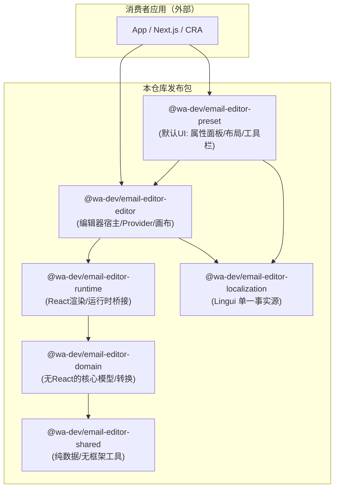

# 架构优化方案（Monorepo / Email Editor）

> 目标：在**不牺牲对外兼容**的前提下，明确分层边界、降低耦合、收敛 UI/插件/I18n 工具链，并让构建与 CI 能够持续约束架构不回退。
> 范围：仅从架构与工程化角度（不是功能需求、也不是 UI 视觉改版）。

---

## 0. 现状与核心问题（结论）

当前仓库属于分层 Monorepo，包职责大体正确，但存在三类关键架构债：

- **边界名实不符**：`email-editor-core` 同时承载领域模型 + React 渲染运行时；`email-editor-extensions` 实际更像「默认产品 UI 预设」而非可选插件包。
- **横切能力未收敛**：i18n（json + lingui）双轨、UI 组件体系多栈并存（arco-adapter + Radix/shadcn + 自研），共享层 `shared` 未充分落地（重复工具/资源）。
- **工程链路不足以约束架构**：串行 build、demo 主要走源码 alias，CI 只测 core/extensions 且安装方式不符合 workspace 最佳实践，导致“发布可用性/依赖契约”缺少自动验证。

---

## 1. 目标架构（北极星）

### 1.1 分层边界（建议的最终形态）



> 说明：这是“目标态”。你可以选择渐进迁移：短期不新建 `domain/runtime/preset` 也能先做 P0/P1 的收敛和契约化（见里程碑）。

### 1.2 对外契约（最重要）

我们需要把“对外稳定 API”显式化，避免扩展包 deep import 内部路径：

- `@wa-dev/email-editor-core`（短期）：只导出稳定接口（Block/JsonToMjml/注册 API），禁止从 `src/**` 级别被外部 import（通过 `exports` 控制）。
- `@wa-dev/email-editor-editor`：只导出 `EmailEditorProvider`、`EmailEditor`、稳定 hooks（`useEditorProps`/`useBlock` 等），其余标记为 internal。
- `@wa-dev/email-editor-extensions`：短期继续作为默认 UI 预设；中期改名为 `preset` 或在 README 明确它不是“插件系统”而是“默认实现”。

---

## 2. 分阶段里程碑（可执行）

### P0（1-3 天）：工程与契约“止血”

目标：**减少漂移来源**，让 CI 能够发现破坏性变更。

#### P0.1 统一 workspace 安装与 CI

- CI 不再在子包里重复 `pnpm install`，改为：
  - 根目录一次 `pnpm install --frozen-lockfile`（如需要）
  - `pnpm -r test` / `pnpm -r build`（或显式脚本）
- CI 增加至少一项：
  - **全量 build**（core/editor/extensions/shared/localization）
  - **demo build**（用“发布产物”或至少用 workspace 依赖方式）

#### P0.2 修正文档与脚本一致性

- 根 `package.json` 里 `demo2` 指向不存在目录（`nextjs-demo`）应修复或移除，避免误导。
- `simple-nextjs-demo` 若是长期示例：
  - 加入 `pnpm-workspace.yaml`，并纳入 CI 的 build。

#### P0.3 明确对外导出边界（不改代码逻辑）

在各包 `package.json` 增加/完善 `exports` 字段（示意）：

```json
{
  "exports": {
    ".": {
      "types": "./lib/index.d.ts",
      "import": "./lib/index.es.js",
      "require": "./lib/index.cjs.js"
    }
  }
}
```

> 目的：让外部消费者只能 import 你允许的入口，从机制上减少“内部文件被依赖导致的破坏性变更”。

---

### P1（1-2 周）：收敛 i18n / shared / 依赖类型

目标：把横切能力变成“单一事实源”，并减少重复与多版本打包风险。

#### P1.1 i18n 闭环：服务端翻译为事实源 + 构建期按快照版本拉取（Lingui 为运行时装载格式）

> 背景：需要“脚本收集 key → 上传服务端 → 中台编辑/审核 → 发布 → 构建拉取 → 产物携带 → 运行时加载”的闭环。
>
> 核心原则：**服务端翻译为唯一事实源**；仓库只保留 key 与默认语言兜底；Lingui（`.mjs`）作为运行时加载的产物格式。

##### P1.1.1 数据模型（MySQL 方案 A：一条翻译一行）

**在线表（编辑态）：`translation_entry`**

- 一行 = 一个 `(project, namespace, locale, key)` 的 `text`（不是“一个语言一列”，也不是“一个 key 存所有语言 JSON”）
- `status` 区分 `draft/published`，中台编辑 `draft`，发布后写入快照

字段建议（可按你们规范调整）：

- `id` BIGINT PK
- `project` VARCHAR(64) NOT NULL（例如 `email-editor` / `editor` / `demo`）
- `namespace` VARCHAR(128) NOT NULL DEFAULT 'default'（可用于按模块发布：core/editor/extensions）
- `locale` VARCHAR(16) NOT NULL（`zh-Hans`/`en`/`ja`…）
- `key` VARCHAR(256) NOT NULL（messageId）
- `text` TEXT NOT NULL
- `status` ENUM('draft','published') NOT NULL
- `updated_by` VARCHAR(64) NULL
- `updated_at` DATETIME NOT NULL
- `published_at` DATETIME NULL

索引建议：

- `UNIQUE(project, namespace, locale, key)`：保证同一 key 的同一语言只有一条“当前态”
- `INDEX(project, namespace, locale, status)`：构建拉取/发布扫描用
- `INDEX(project, namespace, key)`：查某 key 的多语言用

##### P1.1.2 快照与版本（发布态，不可变）

> 你们要的“版本拉取”本质是：构建时传 `snapshotId`，拿到**一组固定的翻译集合**；不传则默认拿“最新已发布快照”。

**快照元表：`translation_snapshot`**

- `snapshot_id` BIGINT PK（自增）或 CHAR(36)（UUID）
- `project` VARCHAR(64) NOT NULL
- `namespace` VARCHAR(128) NOT NULL DEFAULT 'default'
- `created_by` VARCHAR(64) NULL
- `created_at` DATETIME NOT NULL
- `note` VARCHAR(255) NULL（发布说明/工单号）
- `status` ENUM('active','deprecated') NOT NULL DEFAULT 'active'（可选）

**快照明细表（拷贝式，最简单稳定）：`translation_snapshot_item`**

- `snapshot_id` (FK)
- `project`
- `namespace`
- `locale`
- `key`
- `text`
- `source_entry_id` BIGINT NULL（可选：追溯来源）
- `created_at` DATETIME NOT NULL

索引建议：

- `PRIMARY KEY(snapshot_id, locale, key)`（或 `UNIQUE`）
- `INDEX(snapshot_id, locale)`：构建拉取某语言全量用

> 为什么用拷贝式：快照天然即“备份/回滚点”，不会因后续编辑而漂移，查询也快。数据量通常可控（key 数 × locale 数）。

##### P1.1.3 快照触发时机（推荐：发布时生成）

**推荐触发**：在中台点击“发布”时生成快照（Release-based snapshot）。

- **发布事务**（建议同一事务/同一一致性边界）：
  - 选择发布范围（`project+namespace`，或全量）
  - 读取在线表 `translation_entry` 中 `status='published'` 的集合（或把 draft 切换为 published）
  - 生成新的 `snapshot_id`
  - 将集合写入 `translation_snapshot_item`
  - 更新 `translation_snapshot`（并将该 scope 的 `latest_snapshot_id` 指针更新，见下）

**维护 latest 指针（避免“无版本拉取”走实时表）**：

- 方式 A：单独表 `translation_snapshot_latest(project, namespace, snapshot_id, updated_at)`
- 方式 B：在 `translation_snapshot` 上用 `is_latest`，并保证同 scope 只有一个为 true

> 关键点：无论如何，“不传版本”应当返回 **latest 快照**，不要直接返回实时在线表（否则就不是快照，构建不可复现）。

##### P1.1.4 拉取接口契约（构建期）

构建拉取支持两种模式：

- **latest 模式**：不传版本 → 拉取 `latest_snapshot_id`
- **pin 模式**：传 `snapshotId` → 拉取指定快照

建议接口（示意）：

- `GET /i18n/snapshots/latest?project=...&namespace=...` → `{ snapshotId, createdAt }`
- `GET /i18n/messages?project=...&namespace=...&locale=...&snapshotId=...`
  - 返回 `{ messages: Record<string,string>, snapshotId }`

构建端落盘建议：

- 输出到 `packages/email-editor-localization/lingui/<locale>.mjs`（或先生成到 `packages/email-editor-localization/dist/` 再复制到发布目录）
- 同时写一个元信息文件，便于排查：
  - `packages/email-editor-localization/lingui/meta.json`（含 `snapshotId`、`fetchedAt`、`project/namespace`）

##### P1.1.5 缓存与失败策略（避免构建不稳定）

- **缓存**：构建工作区保留上一次成功拉取的 `lingui/*.mjs` 与 `meta.json`
- **失败降级**（按你们发布策略选一条）：
  - 宽松：拉取失败 → 使用缓存 → 构建继续（同时告警）
  - 严格：若是发布流水线（release）则必须拉取成功，否则失败；本地开发可用缓存

##### P1.1.6 与仓库内 `locales/*.json` 的关系

- `locales/*.json` 变为“开发期兜底/脚本输入/迁移快照”（不再作为运行时事实源）
- 运行时加载统一为：
  - `@wa-dev/email-editor-localization/lingui/<locale>.mjs`

##### P1.1.7 验收标准（DoD）

- 构建可选参数 `--snapshotId`（或环境变量 `I18N_SNAPSHOT_ID`）：
  - 不传：拉最新快照
  - 传入：拉指定快照
- 产物内可追溯：能从 `meta.json` 看出使用的 `snapshotId`
- 快照不可变：服务端禁止修改历史快照内容（只能生成新快照）
- 缓存/失败策略明确且可配置（本地与 CI

中台点击发布时，要增加一个描述字段，方便回滚时查看

#### P1.2 落实 `shared`：去重通用资源与工具

优先合并重复点（建议顺序）：

- `getImg`/图片 map：集中到 `shared` 导出纯对象或纯函数
- `awaitForElement` 等 DOM 辅助：若属于 UI 层，仅保留一份（建议在 preset/extensions 内部模块，避免 core 引入 DOM）
- 统一常量（icon map、默认配置）到一个地方，并提供“注册/覆盖”机制

> 原则：`shared` **不依赖** core/editor/extensions；`core` 可以消费 `shared`，由 core 的 Manager 完成注册。

#### P1.3 peerDependencies 与 external 策略一致化

目标：避免消费者侧重复打包、避免版本冲突。

- `react`/`react-dom`：全部为 peer（当前基本已做）
- `mjml-browser`、`react-final-form` 这类宿主强依赖：
  - **建议**：作为 peer（由宿主应用决定版本），包内仅在开发/测试中作为 devDependency
- `lodash`：
  - 若被大量使用且无法替代：external + peer（或者 external + dependency，二选一统一）

---

### P2（2-4 周）：把“扩展”变成真正的插件契约

目标：自定义块/属性面板/市场图标**一次注册**，并支持多编辑器实例隔离。

#### P2.1 统一插件 Manifest

设计一个统一入口（示意）：

- `defineEmailPlugin(plugin)` 返回标准结构
- `registerPlugin(runtime, plugin)` 将其拆分注册到 blocks / attributePanels / marketMeta

Manifest 示例（概念）：

```ts
type EmailEditorPlugin = {
  name: string;
  blocks?: Record<string, IBlock>;
  attributes?: Record<string, React.ComponentType | (() => JSX.Element | null)>;
  market?: {
    categories?: Array<...>;
    icons?: Record<string, string>;
  };
};
```

> 目标：把当前分散的 `BlockManager.registerBlocks`、`BlockAttributeConfigurationManager.add`、`setIconsMap`/`BlockMarketManager` 收敛为“一个插件一次注册”。

#### P2.2 单例 Manager → 可实例化 Runtime（多实例隔离）

当前 Manager 主要是静态 map。建议提供：

- `createEmailEditorRuntime()` 返回包含 blocks/attributes/market 的实例
- React Context 注入 runtime；现有静态 API 作为默认单例兼容层（保持向后兼容）

收益：

- 同页多个 editor 不互相污染
- 测试更容易（每个 test 一个 runtime）
- 插件可以“按实例”启用/禁用

#### P2.3 extensions 重新定位

二选一（推荐 A）：

- **A（推荐）**：把 `email-editor-extensions` 明确为 `preset`（默认 UI 预设）
  - 插件系统是契约；preset 是契约的一个实现
- **B**：保留名字，但 README 明确它是“默认 UI 预设 + 官方扩展集合”，并且对外提供 `plugins` 入口

---

### P3（4-8 周）：Core 拆分为 Domain / Runtime（真正的分层）

目标：让核心能力可在 Node/SSR/非 React 宿主中复用，并降低 core 改动对 UI 的影响面。

#### P3.1 拆出 Domain（无 React）

从 `core` 中抽离到 `domain`（建议包含）：

- typings（数据结构）
- `JsonToMjml`（纯转换，不依赖 React）
- `TemplateEngineManager`（若可保持无 React）
- block 的 schema/metadata（不含 render）

#### P3.2 Runtime 专注 React 渲染与桥接

`runtime` 负责：

- `BlockRenderer`、`MjmlBlock`、block 的 `render`（React）
- 与 `mjml-browser` / preview 的桥接

`editor` 仅作为宿主：Provider、交互、拖拽、选中态、记录/撤销等。

---

## 3. UI 组件体系收敛策略（建议另起专项）

当前存在三套 UI：arco-adapter、Radix/shadcn、editor 自研组件。建议：

- 设立 **唯一 UI 基建包**（例如 `@wa-dev/email-editor-ui` 或 preset 内的 `ui/` 目录），并制定规则：
  - 新代码只允许使用一套（建议 Radix/shadcn + tailwind-merge）
  - arco-adapter 只“减法维护”
- 主题/样式：
  - 统一 tokens（颜色、间距、字体）来源
  - 对外提供可覆写的 theme contract

---

## 4. 风险与回滚策略

### 4.1 风险

- **对外 API 破坏**：尤其是 consumers 依赖了内部路径 import。
- **构建产物不一致**：demo 走源码 alias 会掩盖 lib 构建问题。
- **版本冲突**：将依赖转为 peer 后，消费者需要显式安装（需在 README 写清楚）。

### 4.2 回滚/兼容策略

- 所有重命名/拆包至少保留一个大版本周期的兼容层：
  - `@wa-dev/email-editor-extensions` 可以 re-export 新包内容并打印 deprecate（仅开发环境）
- 单例 → runtime 实例化：
  - 保留默认 runtime 单例，旧 API 调用仍工作
- `exports` 限制：
  - 先在次要版本引入并发布迁移指南，再在主版本严格收口

---

## 5. 验收清单（Definition of Done）

当完成到某个阶段时，应满足以下可验证项：

- **P0 完成**：
  - CI：根目录一次安装；跑全量 build；demo 至少 build 一次
  - 根脚本无死链（不存在目录/脚本）
  - 各包有明确 `exports`（禁止外部 deep import）
- **P1 完成**：
  - i18n：运行时只走 Lingui；json 不再参与运行时加载
  - `shared`：至少消除 2-3 个明显重复模块（如 `getImg`）
  - peer/external 策略一致且 README 说明清楚
- **P2 完成**：
  - 插件注册“一次注册、处处生效”
  - 支持多实例 runtime 隔离（至少 demo 能同时渲染两个 editor）
- **P3 完成**：
  - domain 无 React 依赖，可在 Node 环境跑转换测试
  - runtime/editor/preset 分层清晰，循环依赖为 0

---

## 6. 推荐的落地顺序（最短路径）

如果你希望“收益最快、风险最小”，推荐按以下顺序推进：

1. **P0**（CI + exports + 脚本一致性）
2. **P1.3**（peer/external 一致化）→ 立刻减少消费者问题
3. **P1.1**（i18n 单源）→ 避免长期翻译债
4. **P1.2**（shared 落地）→ 快速去重
5. **P2**（插件 manifest + runtime 实例化）→ 这是扩展能力的根
6. **P3**（domain/runtime 拆分）→ 最后做结构性重构

---

## 7. 下一步（可选：我可以继续做什么）

你选一个方向，我可以直接在仓库里把 P0/P1 的内容落地（提交改动）：

- **方向 A（工程化优先）**：引入 Turbo/Nx，重写 CI 与 build/test 图
- **方向 B（插件契约优先）**：设计并实现 `EmailEditorPlugin` manifest + runtime 实例化（保持兼容）
- **方向 C（shared 去重优先）**：把重复工具/资源迁移到 `shared`，并加 lint 规则阻止回退

