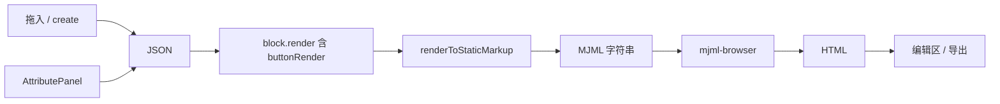

# Button 块架构与渲染链路说明

本文档说明标准 **Button** 块在仓库中的分布、各文件职责，以及 `renderer.tsx` 在整条 **JSON → MJML → HTML** 管线中的位置。内容基于当前代码（`email-editor-blocks-react` + `email-editor-preset`）。

---

## 1. 四个位置与具体用途

同一块「按钮」的逻辑分散在 **2 个包、4 类职责** 中（`plugins/standard/button/` 目录内再拆为 schema / renderer / index）。

### 1.1 总览

| 位置 | 包 | 核心职责 |
|------|-----|----------|
| `schema.ts` | blocks-react | 数据结构、默认值、拖入画布时 `create()` |
| `renderer.tsx` + `index.ts` | blocks-react | JSON → MJML（经 React + `renderToStaticMarkup`） |
| `mjml/core/MjmlBlock.tsx` | blocks-react | 自定义块 render 中用 JSX 拼标准块（已移除 `mjml/jsx`） |
| `plugins/standard/button/panel.tsx` | blocks-react | 右侧属性面板 UI（已从 preset 迁入） |

### 1.2 `schema.ts` — 块长什么样、默认值、父块约束

**路径：** `packages/email-editor-blocks-react/src/plugins/standard/button/schema.ts`

**何时用到：** 从组件库拖入按钮、初始化模板、合并 payload 时。

- 导出 `IButton` 类型（`attributes` + `data.value.content`）
- 导出 `buttonDefinition`：`name`、`type`、`validParentType`、`create()`

`create()` 返回默认 JSON，例如 `content: 'Button'`、`background-color: '#414141'` 等，并与传入的 `payload` 做 `merge`。

### 1.3 `renderer.tsx` + `index.ts` — JSON → MJML

**路径：**

- `packages/email-editor-blocks-react/src/plugins/standard/button/renderer.tsx`
- `packages/email-editor-blocks-react/src/plugins/standard/button/index.ts`

**`buttonRender`：** 把当前块的 JSON 转成带 `<mj-button>` 的 React 片段（经 `BasicBlock`）。

**`index.ts`：** `defineBlock(buttonDefinition, buttonRender)` 得到完整插件 `Button`，并注册到 `standardBlocks`：

```ts
// standardBlocks.ts
[BasicType.BUTTON]: Button,
```

**不负责：** MJML → HTML（见第 2 节）。

### 1.4 `MjmlBlock` — 自定义块里的 JSX 入口（原 `mjml/jsx` 已删除）

**路径：** `packages/email-editor-blocks-react/src/mjml/core/MjmlBlock.tsx`

**何时用到：** 在**其他块**的 `render` 里用 JSX 嵌套标准块；**不是**属性面板。

示例（`createCustomBlock.test.tsx`）：

```tsx
<MjmlBlock type={BasicType.SECTION} padding="20px">
  <MjmlBlock type={BasicType.COLUMN}>
    <MjmlBlock type={BasicType.BUTTON} href="#" background-color="...">
      文案
    </MjmlBlock>
  </MjmlBlock>
</MjmlBlock>
```

`MjmlBlock` 将 props 合并为 `attributes`，再调用对应块的 `buttonRender` 等。

**与 `schema.create()` 的关系：** 也可在 render 里用 `buttonDefinition.create()` + `BlockRenderer`，不必写 JSX。

### 1.5 `panel.tsx` — 属性面板

**路径：** `packages/email-editor-blocks-react/src/plugins/standard/button/panel.tsx`

**何时用到：** 用户选中画布上的按钮，右侧显示「内容 / 链接 / 颜色 / 内边距」等表单项。

通过 `blocks/index.ts` 映射：

```ts
[BasicType.BUTTON]: Button,
```

表单字段绑定 JSON 路径，例如 `${focusIdx}.data.value.content`、`attributes.padding` 等。

**与插件关系：** 只改 JSON，不调用 `buttonRender`；画布更新由 `MjmlDomRender` 在 JSON 变化后重新走 `JsonToMjml` 触发。

**路由：** `preset/AttributePanel/components/blocks/index.ts` 将 `BasicType.BUTTON` 映射为 `ButtonPanel`（从 blocks-react 导入）。

**后续：** 可与 `IButton` 做更强类型绑定（props 传入 `data: IButton`）。

---

## 2. 命名混淆（同一概念多个符号）

| 符号 | 位置 | 实际含义 |
|------|------|----------|
| `IButton` | `schema.ts` | TypeScript 类型 |
| `buttonDefinition` | `schema.ts` | 元数据 + `create()` |
| `buttonRender` | `renderer.tsx` | 渲染函数 |
| `Button` | `plugins/.../button/index.ts` | 完整块插件 `IBlock` |
| `MjmlBlock` | `mjml/core/MjmlBlock.tsx` | 通用 JSX 包装（`type={BasicType.BUTTON}`） |
| `ButtonPanel` | `plugins/.../button/panel.tsx` | 属性面板组件 |

---

## 3. 一条用户操作串起来

```
拖入按钮     → ① buttonDefinition.create()  → 生成 JSON
画布显示     → ② buttonRender + JsonToMjml   → MJML 字符串
             → mjml-browser                  → HTML → 编辑区 DOM
改右侧属性   → ④ AttributePanel 写 JSON
             → 再次 ② + mjml-browser        → 画布更新
自定义块嵌套 → ③ `MjmlBlock`（或 ① `create()` + `BlockRenderer`）
```



---

## 4. `renderer.tsx` 是否只做 JSON → MJML？

**是。** `buttonRender` 只参与 **JSON → MJML**；**不做** MJML → HTML。

### 4.1 完整管线

```
JSON
  → block.render()（从 Page 递归，含 buttonRender）
  → React 树（BasicBlock 等输出 MJML 标签字符串片段）
  → renderToStaticMarkup()     ← JsonToMjml.tsx
  → MJML 字符串
  → mjml() / mjml-browser      ← 调用方（编辑区、导出）
  → HTML
```

`JsonToMjml` 核心逻辑：

```ts
// packages/email-editor-blocks-react/src/JsonToMjml.tsx
const mjmlString = unescape(
  renderToStaticMarkup(
    <EmailRenderProvider ...>
      {block.render(options)}
    </EmailRenderProvider>,
  ),
);
```

`renderer.tsx` 作为 `block.render` 的一环，产出的是上述 React 树中的**一块**；MJML 字符串由 `JsonToMjml` 统一 `renderToStaticMarkup` 得到。

### 4.2 MJML → HTML 在哪里？

在**调用方**，例如：

| 场景 | 文件 | `mode` | MJML→HTML |
|------|------|--------|-----------|
| 中间编辑画布 | `MjmlDomRender.tsx` | `testing` | ✅ `mjml(JsonToMjml(...)).html` |
| 导出 MJML | demo `onExportMJML` | `production` | ❌ |
| 导出 HTML | demo `onExportHTML` | `production` | ✅ |
| 源码面板当前块 | `SourceCodePanel` | `production` | ❌（仅展示 MJML） |

编辑画布**平时就在渲染**，不是等用户点击「预览」才调用 `buttonRender`。

### 4.3 `mode: testing` vs `production`

同一条 `buttonRender`，通过 `EmailRenderProvider` 传入 `mode`，在 `BasicBlock` 等处分支（例如 `testing` 下空图片 URL 用占位图）。按钮块本身分支较少；图片块差异更明显。

- **`testing`**：编辑画布
- **`production`**：导出、源码面板

### 4.4 `index.ts` 的角色

仅装配：`defineBlock(buttonDefinition, buttonRender)` → 注册到 `BlockManager` / `standardBlocks`。

不单独画 UI，也不区分「编辑 / 预览」两条渲染路径。

---

## 5. 与重构提案的关系

详见 [`SCHEMA_ENGINE_REFACTOR_PROPOSAL.md`](./SCHEMA_ENGINE_REFACTOR_PROPOSAL.md)：

- 目标：将 schema、renderer、panel 收拢到 `plugins/standard/button/` 一处
- ~~`mjml/jsx`~~ 已删除；自定义块统一用 `MjmlBlock` 或 `buttonDefinition.create()`
- ~~属性面板迁到 `panel.tsx`~~（Button 已完成；其余块待迁）

---

## 6. 关键文件索引

| 文件 | 作用 |
|------|------|
| `plugins/standard/button/schema.ts` | 类型 + 默认值 + `create()` |
| `plugins/standard/button/renderer.tsx` | `buttonRender`：JSON → MJML 片段 |
| `plugins/standard/button/index.ts` | 插件导出 `Button` |
| `plugins/standard/standardBlocks.ts` | 标准块注册表 |
| `JsonToMjml.tsx` | 调用 `block.render` + `renderToStaticMarkup` |
| `mjml/core/BasicBlock.tsx` | 拼 `<mj-*>` 标签字符串 |
| `mjml/core/BlockRenderer.tsx` | 递归调用子块 `render` |
| `mjml/core/MjmlBlock.tsx` | 自定义块 JSX 入口（内部仍调 `buttonRender`） |
| `plugins/standard/button/panel.tsx` | 属性面板 UI |
| `preset/.../blocks/index.ts` | 面板路由（import `ButtonPanel`） |
| `email-editor-editor/.../MjmlDomRender.tsx` | 编辑区：JsonToMjml + mjml → HTML |

---

## 7. 相关文档

- [`MJML_JSX_MIGRATION.md`](./MJML_JSX_MIGRATION.md) — `mjml/jsx` 删除与迁移对照（已完成）
- [`SCHEMA_ENGINE_REFACTOR_PROPOSAL.md`](./SCHEMA_ENGINE_REFACTOR_PROPOSAL.md) — 块内聚与属性面板迁移（Step 2 待做）

---

*文档生成自架构梳理讨论，便于与 SCHEMA 引擎重构提案对照阅读。*
