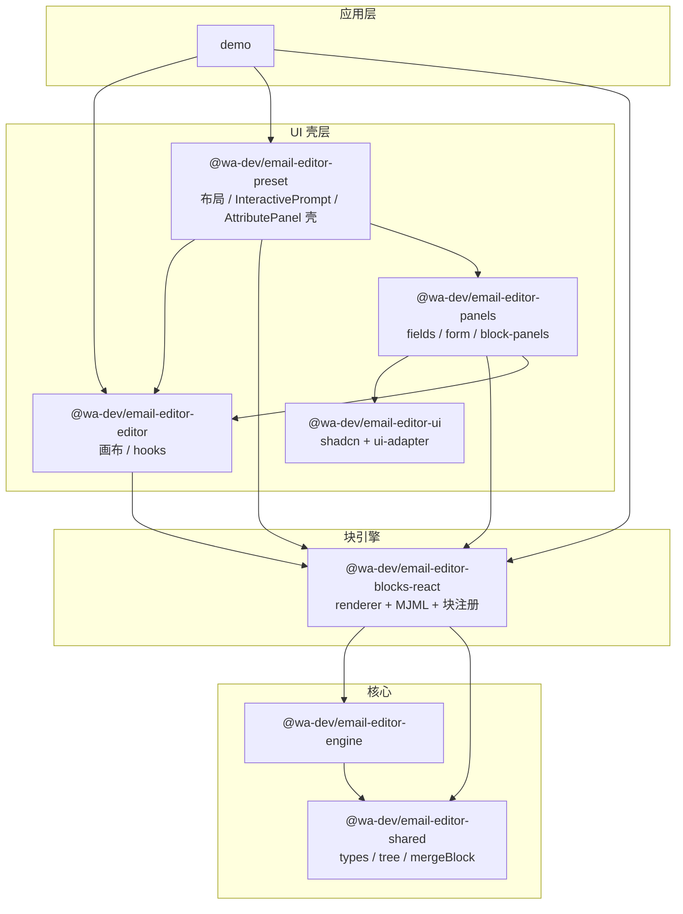
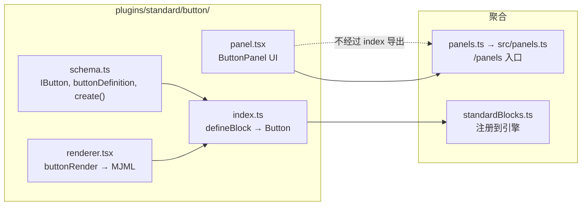
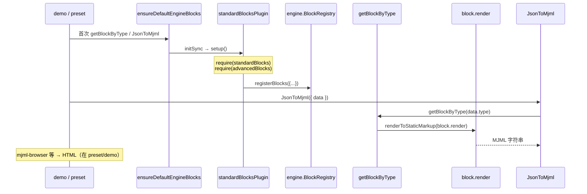
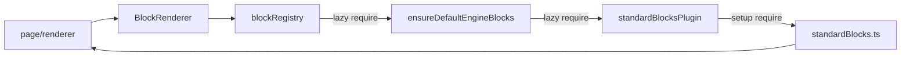

# 当前架构图（Monorepo）

> 快照时间：重构后（2026-06）。属性面板在 `email-editor-panels`，类型/树工具在 `email-editor-shared`，`email-editor-schema` 已移除。  
> **方案与进度**：[UNIFIED_REFACTOR_PLAN.md](./UNIFIED_REFACTOR_PLAN.md)

---

## 1. 包级依赖总览



| 包 | 职责摘要 | 主要入口 |
|----|----------|----------|
| `email-editor-shared` | 类型、`BasicType`/`AdvancedType`、idx 树工具、`mergeBlock` | `.` / `./types` / `./tree` |
| `email-editor-ui` | shadcn 组件、ui-adapter | `@wa-dev/email-editor-ui` |
| `email-editor-panels` | 属性字段、块 panel、Form | `@wa-dev/email-editor-panels` |
| `email-editor-engine` | 插件引擎、`BlockRegistry`、服务容器 | `@wa-dev/email-editor-engine` |
| `email-editor-blocks-react` | 块定义、JSON→MJML 渲染、块注册 | `@wa-dev/email-editor-blocks-react` |
| `email-editor-editor` | 编辑器 React 上下文、`useBlock`、`useFocusIdx` | `@wa-dev/email-editor-editor` |
| `email-editor-preset` | 默认布局、InteractivePrompt、AttributePanel 壳 | `@wa-dev/email-editor-preset` |
| `demo` | 示例应用 | — |

**注意**：`preset` 依赖 `panels`；`panels` 依赖 `blocks-react` + `editor`；`blocks-react` 不再依赖 `preset`（无 panel 环）。

---

## 2. 块插件目录结构（blocks-react）

每个标准块在 `packages/email-editor-blocks-react/src/plugins/standard/{block}/`：



| 文件 | 是否进入主入口 `index` | 是否进入 `/panels` |
|------|------------------------|-------------------|
| `schema.ts` | 类型/definition 部分导出 | 否 |
| `renderer.tsx` | 经 `index.ts` → `standardBlocks` | 否 |
| `index.ts` | 是（`Button` 块） | 否 |
| `panel.tsx` | **否**（避免拉 preset 进引擎测试） | 是（`ButtonPanel`） |

Advanced 块：`plugins/advanced/blocks.ts` + `advancedTablePanel.tsx`，经 `advancedBlocks` 在 `standardBlocksPlugin.setup()` 里与标准块一并注册。

---

## 3. 块注册与渲染链路



**JSON → MJML**：`blocks-react`（`JsonToMjml` + 各块 `renderer` + `BlockRenderer`）。  
**MJML → HTML**：应用侧（如 `mjml-browser`，在 preset 测试/工具里使用）。

---

## 4. 右侧属性面板（当前分裂结构）

```mermaid
flowchart TB
  subgraph preset_attr [preset — AttributePanel]
    AP["AttributePanel.tsx"]
    MGR["BlockAttributeConfigurationManager"]
    BLOCKS_IDX["components/blocks/index.ts<br/>类型 → Panel 映射"]
    ATTR["components/attributes/*<br/>Padding, Color, Link…"]
    FORM["components/Form/*"]
    UI["components/ui-adapter<br/>Collapse, Grid…"]
    ATABLE_OP["blocks/AdvancedTable/Operation/*<br/>仅表格操作未迁"]
  end

  subgraph br_panels [blocks-react — panels]
    PANELS["plugins/standard/*/panel.tsx"]
    ADV_PANEL["advanced/advancedTablePanel.tsx"]
    EXPORT["src/panels.ts → /panels"]
  end

  AP --> MGR
  MGR --> BLOCKS_IDX
  BLOCKS_IDX -->|import| EXPORT
  PANELS --> EXPORT

  PANELS -->|import| ATTR
  PANELS -->|import| FORM
  PANELS -->|import| UI
  PANELS -->|import| preset 根导出

  AP --> ATABLE_OP
```

### 4.1 三层职责

| 层级 | 位置 | 职责 |
|------|------|------|
| **路由** | `preset/AttributePanel.tsx` | 根据 `focusBlock.type` 取 Panel 组件 |
| **块面板** | `blocks-react/.../panel.tsx` | 折叠分组、块特有字段（如按钮文案） |
| **属性字段** | `preset/.../attributes/*` | 可复用表单项，绑定 `focusIdx` |
| **表单原子** | `preset/components/Form/*` | TextField、ColorPicker 等 |

### 4.2 典型 import 方向（Button 为例）

```
ButtonPanel (blocks-react/button/panel.tsx)
  → @wa-dev/email-editor-preset
       AttributesPanelWrapper, Padding, Color, …
       Collapse, Grid, …
  → @wa-dev/email-editor-editor
       useFocusIdx, IconFont, …
```

```
preset/blocks/index.ts
  → @wa-dev/email-editor-blocks-react/panels
       ButtonPanel as Button, …
```

---

## 5. 循环依赖与缓解（现状）



若用**静态** `import` 拉主入口 `blocks-react/index`，可能在 `Page` 未初始化时注册块，导致 Jest 失败。  
当前通过 `blockRegistry` / `ensureDefaultEngineBlocks` / `standardBlocksPlugin` 内 **延迟 `require`** 打破环。

---

## 6. 物理目录对照表

| 能力 | 路径 |
|------|------|
| 块 schema / create | `blocks-react/src/plugins/standard/{block}/schema.ts` |
| 块 MJML 渲染 | `blocks-react/src/plugins/standard/{block}/renderer.tsx` |
| 块注册 | `blocks-react/src/plugins/standard/{block}/index.ts` → `standardBlocks.ts` |
| 块属性面板 | `blocks-react/src/plugins/standard/{block}/panel.tsx` |
| 属性字段组件 | `preset/src/AttributePanel/components/attributes/*.tsx` |
| Panel 路由表 | `preset/src/AttributePanel/components/blocks/index.ts` |
| 表格行列操作 | `preset/.../AdvancedTable/Operation/` |
| MJML 核心组件 | `blocks-react/src/mjml/{MjmlBlock,BlockRenderer,BasicBlock}.tsx` |
| 引擎注册插件 | `blocks-react/src/plugins/standardBlocksPlugin.ts` |

---

## 7. 后续决策时可对照的方案

| 方案 | blocks-react | preset | 依赖方向 |
|------|--------------|--------|----------|
| **现状** | schema + renderer + panel | attributes + 路由 + Operation | preset ↔ blocks-react（环） |
| **A：UI 回 preset** | 仅 schema + renderer | attributes + panel + 路由 | preset → blocks-react |
| **B：UI 并进 blocks-react** | schema + renderer + panel + attributes + Form | 仅布局/工具栏壳 | preset → blocks-react |
| **C：新包 panels** | schema + renderer | 布局壳；新包放 attributes + panel | panels → 两者 |

---

## 8. 相关文档

- [BUTTON_BLOCK_ARCHITECTURE.md](./BUTTON_BLOCK_ARCHITECTURE.md) — Button 块与 JSON→MJML 细节  
- [MJML_JSX_MIGRATION.md](./MJML_JSX_MIGRATION.md) — 已删除 `mjml/jsx` 的迁移说明  
