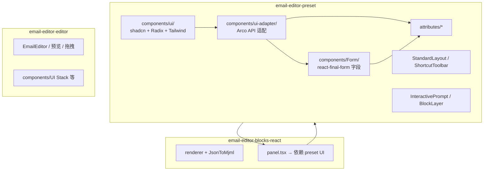
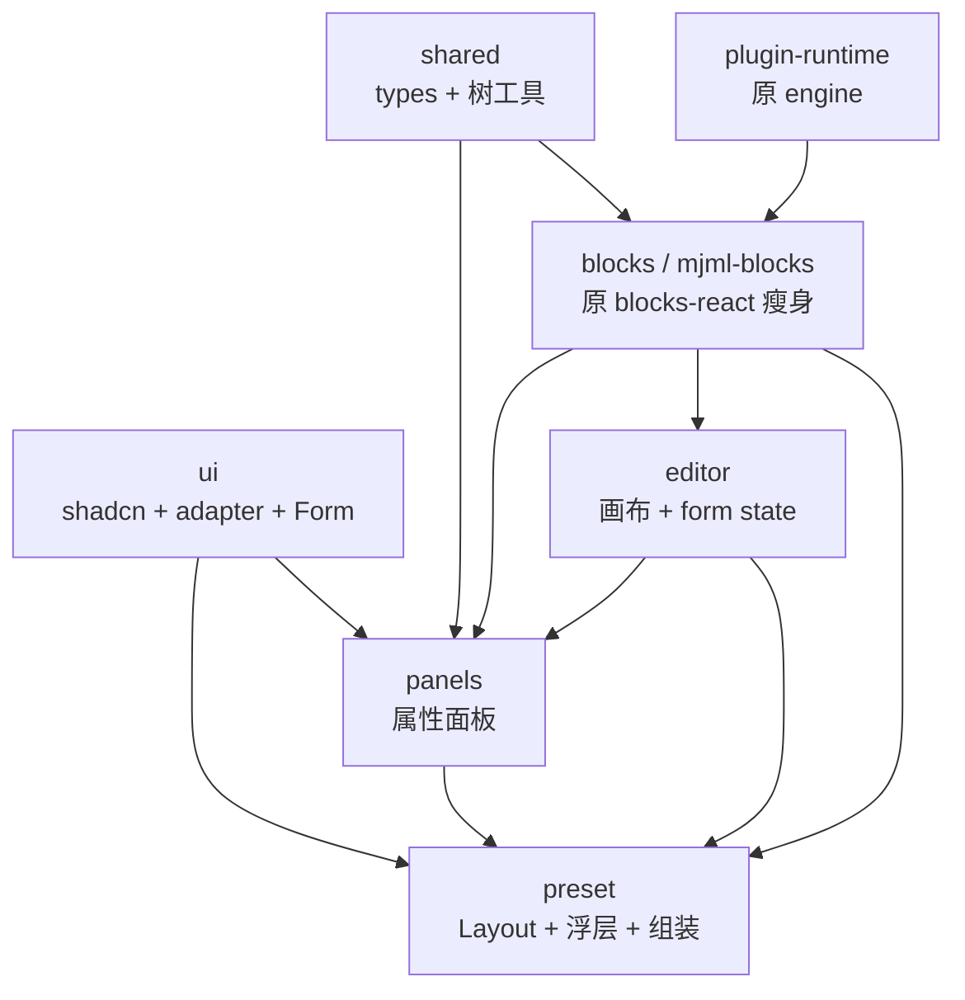

# 包命名与 UI 职责拆分（提案）

> 状态：**提案**，未实施。  
> 关联：[CURRENT_ARCHITECTURE.md](./CURRENT_ARCHITECTURE.md)（现状）、[PANELS_PACKAGE_PROPOSAL.md](./PANELS_PACKAGE_PROPOSAL.md)（属性面板）、[SHARED_FOUNDATION_REFACTOR.md](./SHARED_FOUNDATION_REFACTOR.md)（schema → shared）。

---

## 1. 问题陈述

### 1.1 `@wa-dev/email-editor-blocks-react` 名实不符

**package 描述**（准确）：*MJML block definitions and React renderers* —— 块定义 + JSON→MJML 的 React 渲染。

**实际还包含：**

| 属于块引擎 | 容易误解为「UI 库」 |
|------------|-------------------|
| `plugins/standard/*/schema.ts`、`renderer.tsx` | `panel.tsx`（右侧属性 UI） |
| `JsonToMjml`、`MjmlBlock`、`BlockRenderer` | peer：`preset`、`editor`（为 panel 服务） |
| `standardBlocksPlugin` → engine 注册 | 主入口 re-export 大量类型/工具 |

`-react` 后缀在生态里通常暗示 **组件库**（如 `@xxx/design-react`），新人易把本包当成 UI 框架，而非 **MJML 块引擎**。

### 1.2 `@wa-dev/email-editor-preset` 装了整站 UI 实现

**readme 表述**：*默认产品 UI（属性面板、StandardLayout、工具栏等)*。

**实际还承担：**

- shadcn 原语（`components/ui/`）
- Arco 兼容层（`components/ui-adapter/`）
- 邮件编辑器 Form 字段库（`components/Form/`）
- 属性字段（`AttributePanel/components/attributes/`）
- 块属性面板实现却在 **blocks-react** 的 `panel.tsx`

「preset」更像**主题/布局预设**，不像 **Radix + Tailwind + Form 的实现仓库**。

### 1.3 真正需要「产品级 UI」的三块

与业务直觉一致，重 UI（shadcn / adapter / Form）主要服务：

| 场景 | 典型模块 | 当前主要位置 |
|------|----------|--------------|
| **属性面板** | `attributes/*`、各块 `*Panel` | preset + blocks-react `/panels` |
| **整体 Layout** | `StandardLayout`、`ShortcutToolbar`、`SourceCodePanel` | preset |
| **编辑器操作浮层** | `InteractivePrompt`、`BlockLayer`、`EditPanel` | preset（画布本体在 editor） |

另：**editor** 自带少量画布 UI（`Stack`、`TextStyle`、`Tabs` 等），**不是** preset 的 shadcn 体系，但同属「编辑器界面」。

**MJML 渲染**不应依赖上述 UI；现状 blocks-react 的 panel 破坏了这条边界。

---

## 2. 当前 UI 技术栈落在哪（事实表）



| 路径 | 内容 |
|------|------|
| `preset/src/components/ui/` | shadcn 原语：`button`、`dialog`、`popover`、`select`… |
| `preset/src/components/ui-adapter/` | 对外 Arco 风格 API，内部包 `ui/` |
| `preset/src/components/Form/` | `TextField`、`ColorPickerField`、`RichTextField`… |
| `preset/src/index.tsx` | 再导出 `Collapse`、`Grid`、`Space` 等给 block panel 用 |
| `blocks-react/.../panel.tsx` | 从 `@wa-dev/email-editor-preset` 引入 UI + attributes 组件 |

迁移背景见 [ARCO_TO_SHADCN_MIGRATION.md](./ARCO_TO_SHADCN_MIGRATION.md)。

---

## 3. 目标包职责与命名（推荐）

### 3.1 依赖总览



### 3.2 各包职责表

| 目标包 | 现名 | 职责 | UI |
|--------|------|------|-----|
| **shared** | schema + shared 合并 | 块 JSON 约束（`/types`）、idx 树工具、默认图 URL | 无 |
| **plugin-runtime** | engine（改名可选） | 插件、`BlockRegistry` | 无 |
| **blocks** 或 **mjml-blocks** | blocks-react | 块 `schema`/`renderer`、`JsonToMjml`、插件注册 | **无 panel** |
| **editor** | editor | 画布、Provider、`useBlock` / `useFocusIdx` | 少量画布 UI |
| **ui** | 从 preset 抽出 | `components/ui`、`ui-adapter`、`Form` | **组件库** |
| **panels** | 新建 | `attributes`、各块 `*Panel`、AdvancedTable Operation | 依赖 ui + editor |
| **preset** | preset 瘦身 | StandardLayout、Toolbar、InteractivePrompt、默认导出组装 | 依赖 ui + panels + editor，**不实现**基础组件 |

### 3.3 命名建议

| 现名 | 问题 | 建议 |
|------|------|------|
| `email-editor-blocks-react` | 像 UI 库；含 panel | 迁 panel 后保留或改为 `@wa-dev/email-editor-blocks` / `mjml-blocks` |
| `email-editor-preset` | 承载全部 shadcn+Form | 瘦身为「默认产品壳」；UI 实现 → **ui** 包 |
| `email-editor-engine` | 易被当成渲染引擎 | 可选改为 `plugin-runtime` / `plugin-host` |
| `email-editor-schema` | 混工具与类型 | 见 [SHARED_FOUNDATION_REFACTOR.md](./SHARED_FOUNDATION_REFACTOR.md) |

### 3.4 三块 UI 在目标架构中的归属

| 业务场景 | 目标位置 | 说明 |
|----------|----------|------|
| **属性面板** | `panels` + `ui` | 字段与块 Panel 同包；基础控件在 `ui` |
| **整体 Layout** | `preset` | 只负责页面骨架与组合 |
| **操作弹窗 / 浮层** | `preset`（或 `editor` 扩展） | 与产品预设强相关；可继续用 `ui` 组件 |
| **MJML / 块渲染** | `blocks` | 禁止依赖 `ui` / `panels` / `preset` |

---

## 4. 对外安装体验（不变）

应用方仍可只装：

```sh
npm install @wa-dev/email-editor-editor @wa-dev/email-editor-preset @wa-dev/email-editor-blocks-react
```

`ui`、`panels` 作为 **preset 的 dependencies** 内联传递，不强制用户逐个安装（与 [PANELS_PACKAGE_PROPOSAL.md](./PANELS_PACKAGE_PROPOSAL.md) 一致）。

高级用户：

- 只要 MJML：`blocks` + `shared`
- 自定义布局、自写属性面板：`editor` + `blocks`，不装 `preset`

---

## 5. 实施顺序（与其它提案衔接）

| 阶段 | 内容 | 文档 |
|------|------|------|
| **A** | schema → `shared/types` + 工具 | [SHARED_FOUNDATION_REFACTOR.md](./SHARED_FOUNDATION_REFACTOR.md) |
| **B** | 抽 `ui`：`ui/` + `ui-adapter` + `Form` 出 preset | 本文 §3 |
| **C** | 抽 `panels`：`attributes` + `panel.tsx` 出 blocks-react / preset | [PANELS_PACKAGE_PROPOSAL.md](./PANELS_PACKAGE_PROPOSAL.md) |
| **D** | blocks-react 去 preset peer、可选改名 | 本文 §3.3 |
| **E** | preset 瘦身，仅 Layout + 浮层 + re-export | 本文 §3.2 |
| **F**（可选） | engine → plugin-runtime | 本文 §3.3 |

**建议**：A 与 B 可并行设计；**C 依赖 B**（panel 依赖 Form/ui）；D 在 C 之后。

---

## 6. 风险与原则

| 原则 | 说明 |
|------|------|
| **blocks 包零 UI** | 不依赖 shadcn、不 peer preset |
| **ui 包零业务块** | 不出现 `ButtonPanel`、`BasicType` 业务逻辑 |
| **panels 可依赖 blocks 类型** | 优先 `shared/types`，避免拉 blocks 主入口 |
| **preset 不膨胀** | 新功能默认进 ui / panels / editor，而非继续堆 preset |

| 风险 | 对策 |
|------|------|
| 包数量增加 | npm 用户仍装 3 个主包；内部多包用 workspace 管理 |
| editor 与 ui 两套轻量组件 | 长期可让 editor 的 Stack 等也迁到 `ui` |
| 改名 breaking | 旧包名 re-export 一个主版本周期 |

---

## 7. 评审 checklist

- [ ] 同意 blocks-react **去掉 panel** 后更接近「MJML 块引擎」命名
- [ ] 同意 **shadcn + Form** 从 preset 抽到 **ui** 包（或 `preset-ui`）
- [ ] 同意 **属性面板** 独立 **panels** 包
- [ ] 同意 **preset** 仅保留 Layout + Toolbar + InteractivePrompt + 组装
- [ ] `blocks-react` 是否改名为 `blocks` / `mjml-blocks`
- [ ] `engine` 是否改名为 `plugin-runtime`

---

## 8. 一句话

**`blocks-react` 应代表 MJML 块引擎而非 UI；shadcn/Form 不应埋在 preset 里，而应成为 `ui` 包，供「属性面板、Layout、操作浮层」三类产品 UI 共用；preset 只负责把 editor + panels + layout 拼成默认产品。**
