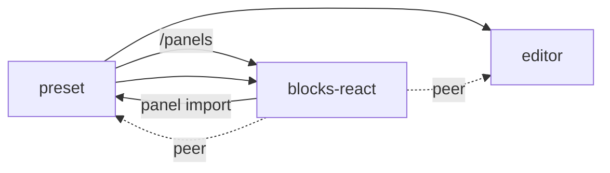
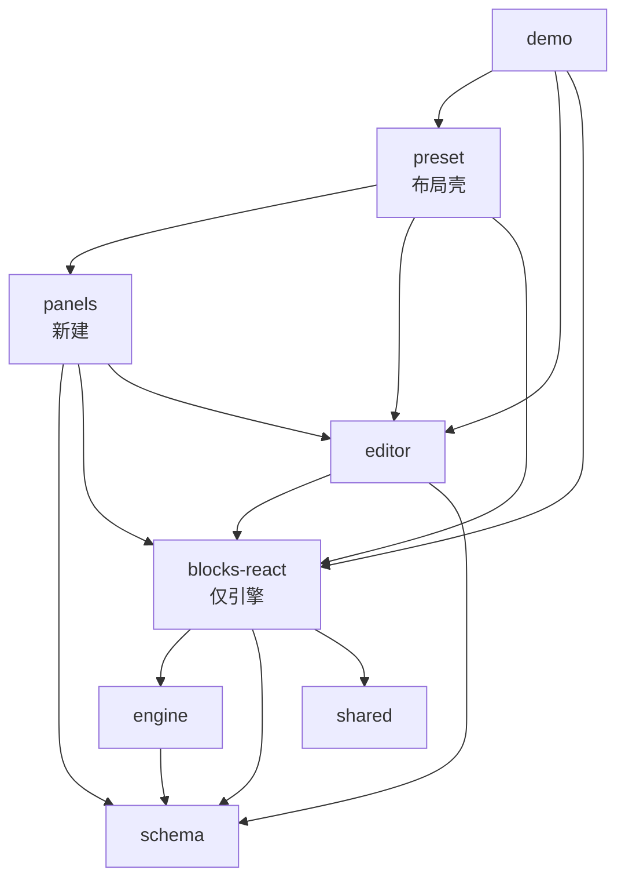
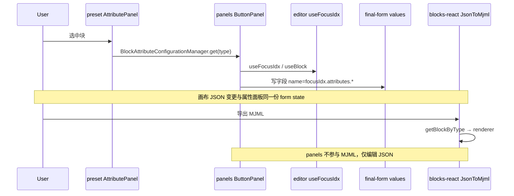
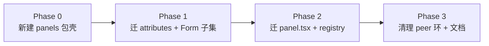

# 属性面板独立包方案与包依赖分析

> 建议包名：`@wa-dev/email-editor-panels`（下文简称 **panels**）  
> 目标：把 `blocks-react` 的 `panel.tsx` 与 `preset` 的 `attributes/*` 抽到同一包，消除 **preset ↔ blocks-react** 环依赖。

---

## 1. 现状 vs 目标

### 1.1 现状（有问题）



- 块 **引擎**（schema/renderer）与 **属性 UI**（panel + attributes）拆在两个包，却互相 import。
- `blocks-react` 为绕开循环，在 `blockRegistry` / `ensureDefaultEngineBlocks` 等处使用延迟 `require`。

### 1.2 目标（单向依赖）



**原则**

| 包 | 允许依赖 | 禁止依赖 |
|----|----------|----------|
| `schema` | 无业务包 | 任意上层 |
| `engine` | `schema` | UI 包 |
| `blocks-react` | `engine`, `schema`, `shared` | `preset`, `panels`, `editor` |
| `editor` | `blocks-react`, `schema`, … | `preset`, `panels` |
| **`panels`（新）** | `editor`, `blocks-react`, `schema` | `preset` |
| `preset` | `panels`, `editor`, `blocks-react` | 被 `panels` 依赖 |

---

## 2. 新包 `email-editor-panels` 应包含什么

### 2.1 从 blocks-react 迁入（约 20 个 panel + 1 advanced）

| 源路径 | 说明 |
|--------|------|
| `blocks-react/src/plugins/standard/*/panel.tsx` | 各块属性面板组合 |
| `blocks-react/src/plugins/advanced/advancedTablePanel.tsx` | Advanced 表格面板 |
| `blocks-react/src/plugins/standard/panels.ts` | 聚合导出 |
| `blocks-react/src/panels.ts` | 包入口（迁后删除 blocks-react 的 `/panels` 导出） |

### 2.2 从 preset 迁入

| 源路径 | 说明 |
|--------|------|
| `preset/.../AttributePanel/components/attributes/**` | 可复用字段（Padding、Color、Link…） |
| `preset/.../attributes/index.ts` | 字段统一导出 |
| `preset/.../attributes/AttributesPanelWrapper` | 面板标题栏 / 显隐 |
| `preset/.../attributes/CollapseWrapper` | Advanced 折叠逻辑 |
| `preset/.../AttributePanel/components/adapter/*` | `pixelAdapter`, `imageHeightAdapter` |
| `preset/.../AttributePanel/components/UI/HtmlEditor.tsx` | Raw/Table 等用 |
| `preset/.../blocks/index.ts` | `BasicType → Panel` 映射（`BlockAttributeConfigurationManager` 的数据源） |
| `preset/.../blocks/AdvancedTable/Operation/**` | 表格行列操作（与 AdvancedTablePanel 同域） |

### 2.3 建议仍留在 preset（壳层，非「块属性」）

| 保留位置 | 说明 |
|----------|------|
| `AttributePanel.tsx` | 路由壳：读 `focusBlock`、挂 Provider、渲染 `BlockAttributeConfigurationManager.get(type)` |
| `components/provider/*` | `PresetColorsProvider`, `SelectionRangeProvider`（包裹整个 AttributePanel） |
| `BlockAttributeConfigurationManager` | 可留 preset，内部 `import { blocks } from '@wa-dev/email-editor-panels'` |
| `StandardLayout` / `ShortcutToolbar` / `BlockLayer` | 编辑器布局 |
| `components/Form/*`（见 2.4） | 视 Form 迁移策略而定 |

### 2.4 关键耦合：`Form` + `ui-adapter`（必须单独决策）

`attributes/*` 与 `panel.tsx` 大量依赖：

- `preset/components/Form`（`ColorPickerField`, `InputWithUnitField`, `TextField`, …）
- `preset/components/ui-adapter`（`Collapse`, `Grid`, `Space`, `Button`, …）
- `preset/hooks/useFontFamily`
- `preset/utils/getContextMergeTags`（MergeTags 字段）

**三种处理方式（二选一 + 可分阶段）：**

| 策略 | 做法 | panels 依赖 | 复杂度 |
|------|------|-------------|--------|
| **A. 同包带走 UI 基座** | 将 Form（属性面板用到的子集）+ ui-adapter 一并迁入 panels 或子路径 `panels/form` | 仅 editor + blocks-react + schema | 中：要梳理 Form 子集 |
| **B. 再拆 `@wa-dev/email-editor-ui`** | Form + ui-adapter → ui 包；panels → ui + editor + blocks-react | 多一个包，边界最清晰 | 高 |
| **C. panels peer 依赖 preset 的 form 子路径** | preset 导出 `@wa-dev/email-editor-preset/form` | **panels → preset**（环可能仍在） | 低但不推荐 |

**推荐：A（首期）或 B（长期）**，避免 C。

---

## 3. 建议的 panels 包内目录

```
packages/email-editor-panels/
  src/
    index.ts                 # 导出 fields、blockPanels、registry、shared
    fields/                  # 原 preset/attributes/*
    block-panels/            # 原 blocks-react/*/panel.tsx（可按 block 分子目录）
      standard/
        button/
          panel.tsx
      advanced/
        advancedTablePanel.tsx
    registry/
      blocks.ts              # 原 preset/blocks/index.ts 的 type → Panel 表
    shared/
      AttributesPanelWrapper/
      CollapseWrapper/
      adapter/
      HtmlEditor.tsx
    table-operation/         # 原 AdvancedTable/Operation
    form/                    # 策略 A：从 preset 迁入的属性面板用 Form 子集
    ui/                      # 策略 A：ui-adapter 子集
```

**对外导出示例**

```ts
// @wa-dev/email-editor-panels
export * from './fields';
export * from './block-panels';
export { blocks, BlockAttributeConfigurationManager } from './registry';
export { pixelAdapter, imageHeightAdapter } from './shared/adapter';
```

---

## 4. 各包依赖关系详表

### 4.1 迁移后依赖矩阵（谁依赖谁）

|  | schema | shared | engine | blocks-react | editor | **panels** | preset | demo |
|--|:--:|:--:|:--:|:--:|:--:|:--:|:--:|:--:|
| **schema** | — | | | | | | | |
| **shared** | | — | | | | | | |
| **engine** | ✓ | | — | | | | | |
| **blocks-react** | ✓ | ✓ | ✓ | — | | | | |
| **editor** | ✓ | ✓ | | ✓ | — | | | |
| **panels** | ✓ | | | ✓ | ✓ | — | | |
| **preset** | | ✓ | ✓ | ✓ | ✓ | ✓ | — | |
| **demo** | | | | ✓ | ✓ | ✓ | ✓ | — |

（✓ = 允许依赖；空 = 不依赖）

### 4.2 各包职责与典型 import

#### `@wa-dev/email-editor-schema`

- **职责**：`BasicType` / `AdvancedType`、`IBlockData` 形状、idx 树工具（`getParentByIdx` 等）。
- **依赖**：无 monorepo 业务包。
- **panels 用法**：字段组件应用 `getParentByIdx` 时优先从 **schema** 引，减少对 blocks-react 主入口的依赖。

#### `@wa-dev/email-editor-engine`

- **职责**：`EmailEditorEngine`、`BlockRegistry`、插件 `setup`。
- **依赖**：`schema`。
- **与 panels**：无直接依赖；注册仍在 `blocks-react` 的 `standardBlocksPlugin`。

#### `@wa-dev/email-editor-blocks-react`（迁移后瘦身）

- **职责**：`schema.ts`、`renderer.tsx`、`MJML（MjmlBlock/BlockRenderer）`、`JsonToMjml`、`blockRegistry`（引擎注册）。
- **移除**：所有 `panel.tsx`、`src/panels.ts`、`package.json` 的 `./panels` 导出、对 `preset` / `editor` 的 **peerDependency**。
- **对外类型**：继续导出 `AdvancedBlock`、`IAdvancedTableData`、`isAdvancedBlock` 等（panels 的 Condition/Iteration 需要）。

#### `@wa-dev/email-editor-editor`

- **职责**：画布、`useBlock` / `useFocusIdx` / `useEditorProps`、`IconFont`、`Stack` 等。
- **依赖**：`blocks-react`、`schema`（已有）。
- **与 panels**：panels **peerDepend** editor；所有字段绑定 `focusIdx` 的组件依赖此包。

#### `@wa-dev/email-editor-panels`（新）

- **职责**：属性字段库 + 块级 Panel + 类型路由表 + 表格 Operation。
- **dependencies**：`@lingui/core`、`lodash`、`react-final-form`（与现 preset 类似）等 UI 运行时。
- **peerDependencies**：
  - `react`, `react-dom`
  - `@wa-dev/email-editor-editor`
  - `@wa-dev/email-editor-blocks-react`（类型 + `getBlockByType` + Advanced 类型）
  - `@wa-dev/email-editor-schema`
- **禁止**：`@wa-dev/email-editor-preset`。

#### `@wa-dev/email-editor-preset`（迁移后瘦身）

- **职责**：`StandardLayout`、`ShortcutToolbar`、`BlockLayer`、`AttributePanel` 外壳、全局 Provider、RichText 工具栏等与「整页编辑器」强绑定的 UI。
- **变更**：
  - `import { ButtonPanel, Padding, blocks } from '@wa-dev/email-editor-panels'`
  - 删除 `export * from './components/attributes'`（改 re-export panels 或不再导出）
  - `AttributePanel/index.tsx` 的 `DefaultPageConfigPanel` 改从 panels 引入

#### `demo`

- 继续 `preset` + `editor` + `blocks-react`；一般 **不直接** 依赖 panels（经 preset 间接使用）。

---

## 5. 数据流（迁移后不变）



---

## 6. 需要从 blocks-react 抽离的类型依赖（panels ← blocks-react）

panels 内文件当前从 blocks-react 引用的大致分类：

| 类别 | 示例 | 迁移后建议 |
|------|------|------------|
| 块数据类型 | `IButton`, `IText`, `INavbar` | 从 `blocks-react` 类型导出或 `blocks-react/button/schema` 子路径 |
| Advanced | `AdvancedBlock`, `Operator`, `IAdvancedTableData` | 保留从 `blocks-react` 或迁到 `schema`（长期） |
| 工具函数 | `isAdvancedBlock`, `getBlockByType` | `getBlockByType` 留 blocks-react；`getParentByIdx` 改 schema |
| 常量 | `BasicType`, `AdvancedType` | 优先 **schema** |

**瘦身方向**：panels 对 blocks-react 尽量 **type-only + getBlockByType**，避免 `import '@wa-dev/email-editor-blocks-react'` 主入口触发整包副作用。

---

## 7. preset 侧需改的引用（清单）

| 文件/区域 | 现状 | 迁后 |
|-----------|------|------|
| `AttributePanel/components/blocks/index.ts` | `@wa-dev/email-editor-blocks-react/panels` | 删除或移至 panels 包内 `registry/blocks.ts` |
| `AttributePanel/index.tsx` | 导出 attributes + panels 的 PagePanel | `export { … } from '@wa-dev/email-editor-panels'` |
| `AttributePanel.tsx` | `BasicType` from blocks-react | `schema` 或 panels 再导出 |
| `Condition` / `Iteration` | 在 attributes，随包迁走 | — |
| `RichTextToolBar` 等 | `useSelectionRange` from AttributePanel | 仍 preset；Provider 留在 preset 包裹 panels |

---

## 8. blocks-react 侧需改的引用（清单）

| 项 | 动作 |
|----|------|
| 删除全部 `panel.tsx` | 迁至 panels |
| 删除 `src/panels.ts`、`plugins/standard/panels.ts` | 迁至 panels |
| `package.json` 移除 `./panels` exports | |
| 移除 peerDependencies：`preset`, `editor`, `react-final-form` | |
| `button/index.ts` 等 | 保持不导出 panel（已无 panel） |

---

## 9. 实施阶段建议



| 阶段 | 内容 | 验收 |
|------|------|------|
| **0** | `packages/email-editor-panels`、tsconfig、vite build、workspace | 空包可 build |
| **1** | 迁 `attributes` + Wrapper + adapter + Form/ui 子集；preset 改 import | preset 测试通过 |
| **2** | 迁 `panel.tsx` + `registry/blocks` + AdvancedTable Operation；删 blocks-react `/panels` | blocks-react 无 preset peer；双包 jest 绿 |
| **3** | `schema` 收敛常量引用、文档、demo 依赖核对 | 依赖矩阵无环 |

---

## 10. 风险与对策

| 风险 | 对策 |
|------|------|
| Form 牵一发而动全身 | 先梳理 attributes+panel 实际 import 的 Form 文件清单（约 15–20 个），只迁子集 |
| `@extensions` 路径别名 | panels 包内改用相对路径或 `@panels/*`，不复制 preset 的 `@extensions` |
| `PresetColorsProvider` 在 preset、Color 在 panels | 保持 Provider 在 preset 外层包裹；panels 用 Context 或 props 注入 |
| 第三方只装 blocks-react 不要 UI | 迁移后 **真正** 做到 blocks-react 无 UI peer，发布说明写清 |
| 自定义块 Panel 注册 | `BlockAttributeConfigurationManager.add()` 仍可在 preset/demo 调用，map 定义可导出自 panels |

---

## 11. UI 包与 preset 职责

shadcn / `ui-adapter` / `Form` 当前均在 **preset**，不应长期作为 panels 的「宿主」。目标态：

- **`@wa-dev/email-editor-ui`**（新建）：`components/ui` + `ui-adapter` + `Form`
- **`panels`**：依赖 **ui** + editor + shared/blocks
- **`preset`**：Layout、Toolbar、InteractivePrompt + 组装，依赖 ui + panels

详见 [PACKAGE_NAMING_AND_UI_SPLIT.md](./PACKAGE_NAMING_AND_UI_SPLIT.md)。

---

## 12. 与 [CURRENT_ARCHITECTURE.md](./CURRENT_ARCHITECTURE.md) 的关系

- **CURRENT_ARCHITECTURE.md**：描述**当前**分裂状态与环依赖。  
- **本文**：描述**目标**独立 panels 包及迁移后各包依赖。  

决策参考：

- 若接受多一个包且愿意迁 Form 子集 → 采用本文 **panels + 策略 A/B**。  
- 若希望改动最小 → 见 CURRENT_ARCHITECTURE **方案 A**（panel 回 preset，不新建包）。  

---

## 13. 总结一句话

**新建 `@wa-dev/email-editor-panels` 专门承载「属性字段 + 块 Panel + 路由表」**，使依赖变为：

`preset → panels → (editor + blocks-react + schema)`，**blocks-react 不再依赖 preset/editor**，从根上消除当前最乱的环。
