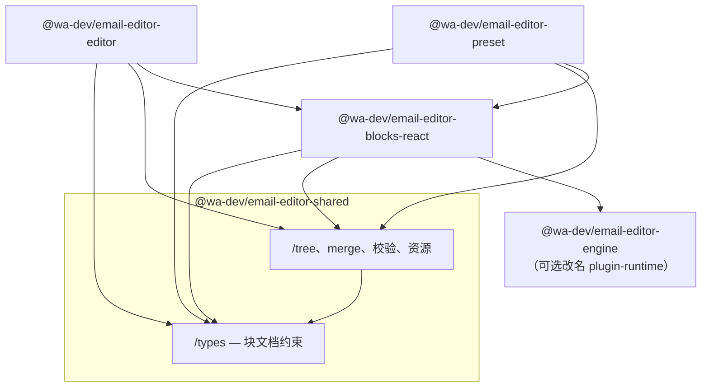

# Shared 基础层重构思路（吸收 schema · 状态：提案）

> 本文记录 Monorepo 底层包分工的**目标形态**与迁移原则，供实施前评审。  
> 与 [CURRENT_ARCHITECTURE.md](./CURRENT_ARCHITECTURE.md)（现状）、[PANELS_PACKAGE_PROPOSAL.md](./PANELS_PACKAGE_PROPOSAL.md)（属性面板拆包）并列阅读。

---

## 1. 背景与问题

### 1.1 `@wa-dev/email-editor-schema` 名实不符

| 内容 | 实际性质 | 是否「schema」 |
|------|----------|----------------|
| `IBlockData`、`BasicType` / `AdvancedType` | 邮件块 JSON **文档契约** | 偏「领域类型」 |
| `tree.ts`（`getParentByIdx` 等） | 对文档树的 **运行时操作** | 工具，不是约束 |
| `mergeBlock`、`isValidBlockDataShape` | 合并 / 校验 **工具** | 工具 |
| `JsonToMjmlOption` | 渲染 API 选项类型 | 更贴近 blocks-react |

结论：**不宜继续叫 schema**——包内混了「约束」与「工具」，且约束范围主要是**块文档**，不是整站数据 schema。

### 1.2 `@wa-dev/email-editor-shared` 名实不符（另一侧）

当前 shared 几乎只有默认图片 URL，**没有承担「跨包基础层」职责**。

### 1.3 设计目标（共识）

1. **约束（types）与工具（utils）分开目录**，可同包不同入口。  
2. **块文档契约**属于全仓库共用（editor、preset、blocks-react、解析工具），**不必**绑在 `blocks-react` 实现包上。  
3. **少增 npm 包**：优先扩实 `shared`，而不是再建 `types` 包（除非后续 shared 膨胀再拆）。  
4. **依赖单向**：底层不引用 UI / 块实现 / preset。

---

## 2. 目标架构

### 2.1 包职责（重构后）



| 包 | 职责 | 禁止依赖 |
|----|------|----------|
| **shared/types** | 块 JSON 形状、块类型枚举、与契约绑定的常量（如 `EMAIL_BLOCK_CLASS_NAME`） | blocks-react、preset、editor、engine 实现 |
| **shared（工具 & 资源）** | idx 树操作、`mergeBlock`、结构校验、默认图 URL 等 | 同上（仅可 `import type` 自 types） |
| **engine** | 插件注册、`BlockRegistry`、生命周期（**不是** MJML 渲染引擎） | UI 包 |
| **blocks-react** | 块 `create` / `render`、MJML、`JsonToMjml`、插件 `standardBlocksPlugin` | preset（去掉 panel 环后） |
| **preset** | 布局、工具栏、AttributePanel **壳**；属性 UI 见 panels 提案 | — |

### 2.2 为何块约束放在 shared/types，而不是 blocks-react

| 放 blocks-react | 放 shared/types |
|-----------------|-----------------|
| 类型与块实现强绑定 | **文档模型**与实现解耦 |
| editor / preset 为类型必依赖 blocks-react | 可为「只解析 JSON」的场景只引 shared |
| 易与 panel、渲染逻辑混在同一心理模型 | shared = 全 monorepo **地基** |

### 2.3 engine 命名（可选、独立决策）

当前 `engine` 实际是 **插件宿主 + 块注册表**，不负责渲染。

| 选项 | 说明 |
|------|------|
| 保留 `engine` | 在 readme 写清：*插件运行时，非 MJML 引擎* |
| 改名为 `plugin-runtime` / `plugin-host` | 语义更准确，需 breaking rename |

**与 shared 重构可并行或延后**，不阻塞 schema → shared 迁移。

---

## 3. shared 包内目录规划

```
packages/email-editor-shared/
  src/
    types/                          # ① 约束（无运行时副作用）
      block-data.ts                 # IBlockData, RecursivePartial
      block-types.ts                # BasicType, AdvancedType, BlockType, 类名常量
      blocks/                       # 可选：各块 IButton, IPage…（从 blocks-react/schema 逐步迁入）
      index.ts
    tree/
      index.ts                      # 原 schema/tree.ts
    merge-block.ts                  # 原 schema/mergeBlock.ts
    is-valid-block-data.ts          # 原 schema/isValidBlockData.ts
    assets/
      image-default.ts
      default-image-urls.ts
    index.ts                        # 总 barrel（或仅 re-export，推荐子路径为主）
```

### 3.1 建议的 package.json exports

```json
{
  ".": {
    "types": "./lib/index.d.ts",
    "import": "./lib/index.js"
  },
  "./types": {
    "types": "./lib/types/index.d.ts",
    "import": "./lib/types/index.js"
  },
  "./tree": {
    "types": "./lib/tree/index.d.ts",
    "import": "./lib/tree/index.js"
  }
}
```

**推荐 import 习惯：**

```ts
// 约束
import type { IBlockData } from '@wa-dev/email-editor-shared/types';
import { BasicType } from '@wa-dev/email-editor-shared/types';

// 工具
import { getParentByIdx, mergeBlock } from '@wa-dev/email-editor-shared';
// 或
import { getParentByIdx } from '@wa-dev/email-editor-shared/tree';
```

### 3.2 纪律（types 子路径）

| 允许 | 禁止 |
|------|------|
| `interface` / `type` / `enum` / 字符串常量 | React 组件、hooks |
| 各块 `IButton` 等数据形状 | `create()` / `render()` 实现 |
| `import type` 互相引用 | types 引用 blocks-react、preset、editor |
| — | 在 types 里使用 lodash 运行时逻辑 |

### 3.3 `JsonToMjmlOption` 放哪（待定）

| 方案 | 说明 |
|------|------|
| **A（推荐）** | 留在 **blocks-react**（渲染 API，非纯文档模型） |
| B | 放 shared/types，与 `IBlockData` 并列 |

`isProductionMode()` 跟选项类型走，放实现侧（shared 工具或 blocks-react）。

---

## 4. 从 schema 迁出的对照表

| 现路径（schema） | 目标（shared） |
|------------------|----------------|
| `src/types/index.ts` | `src/types/block-data.ts` |
| `src/constants.ts` | `src/types/block-types.ts` |
| `src/tree.ts` | `src/tree/index.ts` |
| `src/mergeBlock.ts` | `src/merge-block.ts` |
| `src/isValidBlockData.ts` | `src/is-valid-block-data.ts` |
| `src/jsonToMjml.ts`（类型） | blocks-react 或 `shared/types`（见 3.3） |
| `package.json` | **deprecated** → re-export shared |

---

## 5. 各包依赖变化（摘要）

| 包 | 变更 |
|----|------|
| **shared** | 增加 `lodash`（tree / merge）；扩 build 输出 types、tree 子路径 |
| **schema** | 废弃；仅保留兼容 re-export 1～2 个主版本 |
| **blocks-react** | `dependencies`: shared；import 从 schema 改为 `shared/types`、`shared/tree`；主入口可继续 **re-export** 常用符号 |
| **editor** | 逐步改为 `shared/types` + `shared/tree`；或继续经 blocks-react re-export |
| **preset** | `parseXMLtoBlock`、`MjmlToJson` 等改引 shared |
| **engine** | 仍可不依赖 shared；`BlockRegistryEntry` 保持包内薄接口，或与 shared/types 对齐（`import type`） |

**目标依赖链（readme 可改为）：**

```
shared → engine → blocks-react → editor → preset
```

---

## 6. 与其它重构提案的关系

| 提案 | 关系 |
|------|------|
| [PANELS_PACKAGE_PROPOSAL.md](./PANELS_PACKAGE_PROPOSAL.md) | 属性 panel + attributes 抽 `panels` 包；**依赖** shared/types，不依赖 schema |
| [PACKAGE_NAMING_AND_UI_SPLIT.md](./PACKAGE_NAMING_AND_UI_SPLIT.md) | blocks 命名、ui 从 preset 抽出、三块 UI 归属 |
| [CURRENT_ARCHITECTURE.md](./CURRENT_ARCHITECTURE.md) | 描述**迁移前**现状；完成后应更新快照 |
| [SCHEMA_ENGINE_REFACTOR_PROPOSAL.md](./SCHEMA_ENGINE_REFACTOR_PROPOSAL.md) | 历史「schema + engine 拆分」记录；**shared 吸收 schema** 后，其中「schema 含 tree」的描述以**本文**为准 |

**panels 包**：仍建议 `panels → shared/types` + editor，避免 preset ↔ blocks-react 环。

---

## 7. 实施阶段（建议顺序）

| 阶段 | 内容 | 验收 |
|------|------|------|
| **0** | 在 shared 内建立 `types/`、`tree/`，复制代码，shared 自身 build 通过 | `tsc` / build green |
| **1** | blocks-react 改 import；jest blocks-react 绿 | 114+ tests |
| **2** | editor、preset、demo 改 import；preset jest 绿 | parseXML、MjmlToJson tests |
| **3** | schema 包改为 re-export shared；readme、迁移表更新 | 旧 import 仍可用 |
| **4** | 删除 schema 包（或下一大版本移除 re-export） | 全仓无 `@wa-dev/email-editor-schema` |
| **5**（可选） | 各块 `I*` 迁入 `shared/types/blocks/`；engine 改名 | 文档同步 |

---

## 8. 对外兼容策略

```ts
// packages/email-editor-schema/src/index.ts（过渡期）
export * from '@wa-dev/email-editor-shared/types';
export * from '@wa-dev/email-editor-shared';
```

readme「包说明」表：

| 旧包 / 导入 | 新导入 |
|-------------|--------|
| `@wa-dev/email-editor-schema` | `@wa-dev/email-editor-shared/types` + `@wa-dev/email-editor-shared` |
| `BasicType`、`IBlockData` | 同上，或继续 `blocks-react` re-export |
| `getPageIdx`、`mergeBlock` | `@wa-dev/email-editor-shared` 或 `/tree` |

---

## 9. 风险与对策

| 风险 | 对策 |
|------|------|
| shared 膨胀成「第二个 preset」 | 严守 types 无 UI；大块逻辑不进 shared |
| 双入口混乱（shared vs blocks-react re-export） | 文档约定：**库开发用 shared 子路径；应用可继续 blocks-react** |
| tree 依赖 DOM 类型（`DOMTokenList`） | 保持纯函数；必要时 typings 声明，不引 React |
| 与 panels / preset 重构并行冲突 | 先完成 shared 地基，再动 panels |

---

## 10. 决策摘要（评审用 checklist）

- [ ] 同意废除独立 **schema** 包，由 **shared** 承接  
- [ ] 同意 **shared/types** = 块文档约束，**shared** 其余 = 树工具 + merge + 资源  
- [ ] 同意块约束**不**放进 blocks-react 主包（可用 re-export）  
- [ ] `JsonToMjmlOption` 放 blocks-react（方案 A）或 shared/types（方案 B）  
- [ ] engine 是否改名为 plugin-runtime（可选）  
- [ ] schema 兼容 re-export 保留几个主版本  

---

## 11. 一句话

**用 `@wa-dev/email-editor-shared` 做全仓库地基：`/types` 放块 JSON 约束，其余放树操作与共用工具；删掉名不副实的 schema 包，engine 继续只管插件与注册表。**
