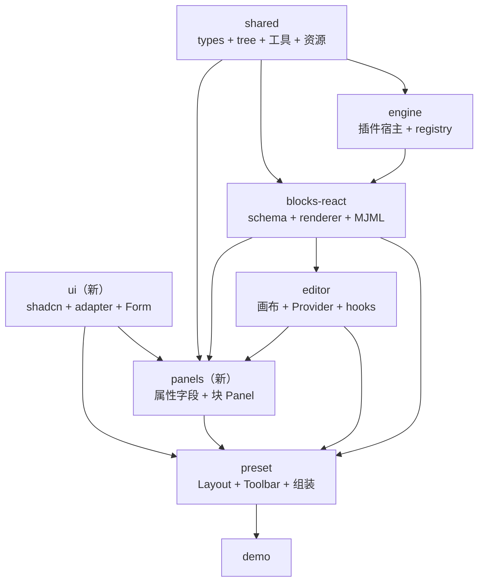
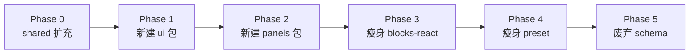

# 统一重构方案：包命名、职责与迁移计划

> 状态：**Phase 0–5 已验收完成**（2026-06-03）  
> 整合自：`SHARED_FOUNDATION_REFACTOR.md`、`PACKAGE_NAMING_AND_UI_SPLIT.md`、`PANELS_PACKAGE_PROPOSAL.md`、`SCHEMA_ENGINE_REFACTOR_PROPOSAL.md`

### 验收结论（代码库核对）

| 检查项 | 结果 |
|--------|------|
| `email-editor-schema` 包 | ✅ 已从 monorepo 删除 |
| TS 源码 `import … schema` | ✅ 0 处 |
| `blocks-react` 无 `panel.tsx` | ✅ |
| `blocks-react` 无 `preset` peerDependency | ✅（仅 devDependencies 用于测试） |
| `preset` 无 `components/ui/`、`Form/` | ✅ |
| `preset` 无 `components/ui-adapter/` 转发目录 | ✅（直连 `@wa-dev/email-editor-ui`） |
| `AttributePanel.tsx` | ✅ 约 71 行（壳 + panels Provider） |
| `pnpm run build` / `test` | ✅ 全链通过 |
| **未做（非阻塞）** | 对外 CHANGELOG 写明 schema 废弃；`classnames` 迁入 shared；blocks-react 测试用 preset devDep |

### 实施进度

| 阶段 | 状态 | 说明 |
|------|------|------|
| **Phase 0** | ✅ 完成 | `shared` 扩充 `types/`、`tree/`、`mergeBlock`、`isValidBlockData` |
| **Phase 1** | ✅ 完成 | 新建 `@wa-dev/email-editor-ui`（shadcn + ui-adapter）；preset 已删除本地 adapter 转发 |
| **Phase 2** | ✅ 完成 | 新建 `@wa-dev/email-editor-panels`（fields、form、block-panels、registry） |
| **Phase 3** | ✅ 完成 | blocks-react 删除全部 `panel.tsx`；无 preset peer |
| **Phase 4** | ✅ 完成 | preset 瘦身为 Layout + InteractivePrompt + AttributePanel 壳 |
| **Phase 5** | ✅ 完成 | schema 包删除；import 迁至 `shared` / `blocks-react` |

---

## 1. 当前问题总结

### 1.1 包职责混乱

| 现有包 | 问题 |
|--------|------|
| `email-editor-schema` | 名实不符：混了"约束"与"工具"，不是真正的 schema |
| `email-editor-blocks-react` | 名像 UI 库，实为 MJML 块引擎；含 panel 导致与 preset 循环依赖 |
| `email-editor-preset` | 太胖：承载 shadcn + Form + ui-adapter + Layout + 属性面板 |
| `email-editor-shared` | 太瘦：几乎只有默认图片 URL |

### 1.2 循环依赖

```
blocks-react (panel.tsx) ──依赖──> preset (Form, ui-adapter)
       ↑                                    │
       └──────── preset (AttributePanel) ───┘
```

---

## 2. 目标包结构

### 2.1 包清单对照表

| 现有包 | 去向 | 新名称（建议） | 说明 |
|--------|------|---------------|------|
| `email-editor-schema` | **废弃** | — | 内容迁入 shared |
| `email-editor-shared` | **扩充** | 保持 `shared` | 成为全仓库地基 |
| `email-editor-engine` | **保留** | 可选改名 `plugin-runtime` | 插件宿主 + BlockRegistry |
| `email-editor-blocks-react` | **瘦身** | 可选改名 `mjml-blocks` | 仅保留 schema + renderer + MJML |
| `email-editor-editor` | **保留** | 保持 `editor` | 画布 + Provider + hooks |
| `email-editor-preset` | **瘦身** | 保持 `preset` | 仅保留 Layout + Toolbar + 组装 |
| — | **新建** | `email-editor-ui` | shadcn + ui-adapter + Form |
| — | **新建** | `email-editor-panels` | 属性字段 + 各块 Panel + 路由表 |

### 2.2 目标依赖图



**核心原则**：所有箭头单向，无循环。

---

## 3. 各包详细职责

### 3.1 `@wa-dev/email-editor-shared`（扩充）

**定位**：全仓库地基，提供类型约束和通用工具。

**目录结构**：

```
packages/email-editor-shared/
  src/
    types/                          # ① 块文档约束（无运行时）
      block-data.ts                 # IBlockData, RecursivePartial
      block-types.ts                # BasicType, AdvancedType, 类名常量
      blocks/                       # 可选：各块 IButton, IPage…
      index.ts
    tree/                           # ② idx 树操作
      index.ts                      # getParentByIdx, getChildIdx, getSiblingIdx…
    merge-block.ts                  # 原 schema/mergeBlock.ts
    is-valid-block-data.ts          # 原 schema/isValidBlockData.ts
    assets/
      default-image-urls.ts
    index.ts
```

**package.json exports**：

```json
{
  ".": { "import": "./lib/index.js" },
  "./types": { "import": "./lib/types/index.js" },
  "./tree": { "import": "./lib/tree/index.js" }
}
```

**使用示例**：

```ts
// 约束
import type { IBlockData } from '@wa-dev/email-editor-shared/types';
import { BasicType } from '@wa-dev/email-editor-shared/types';

// 工具
import { getParentByIdx, mergeBlock } from '@wa-dev/email-editor-shared';
```

**禁止依赖**：任何上层包（engine、blocks-react、editor、preset、panels、ui）

---

### 3.2 `@wa-dev/email-editor-schema`（废弃）

**处理方式**：

1. 内容全部迁入 `shared`
2. 保留 1-2 个主版本的兼容 re-export
3. 最终删除

**兼容导出（过渡期）**：

```ts
// packages/email-editor-schema/src/index.ts
export * from '@wa-dev/email-editor-shared/types';
export * from '@wa-dev/email-editor-shared';
```

---

### 3.3 `@wa-dev/email-editor-engine`（保留）

**定位**：插件宿主 + BlockRegistry，支持多实例隔离。

**职责**：

| 包含 | 不包含 |
|------|--------|
| `EmailEditorEngine` | React 组件 |
| `BlockRegistry` | MJML 渲染 |
| 插件 `setup` / `dispose` | 属性面板 |
| services 容器（ImageService、TemplateService） | UI |

**可选改名**：`plugin-runtime` / `plugin-host`（语义更准确）

**依赖**：仅 `shared`

---

### 3.4 `@wa-dev/email-editor-blocks-react`（瘦身）

**定位**：MJML 块引擎，负责块定义和渲染。

**迁移后保留**：

| 保留 | 移除 |
|------|------|
| `plugins/*/schema.ts` | `plugins/*/panel.tsx` → panels |
| `plugins/*/renderer.tsx` | `src/panels.ts` → panels |
| `mjml/core/MjmlBlock.tsx` | 对 preset 的 peerDependency |
| `JsonToMjml` | 对 editor 的 peerDependency |
| `blockRegistry` / `standardBlocksPlugin` | react-final-form 依赖 |

**目录结构（迁移后）**：

```
packages/email-editor-blocks-react/
  src/
    plugins/
      standard/
        button/
          schema.ts           # IButton + buttonDefinition
          renderer.tsx        # MJML 渲染
          index.ts            # 导出（无 panel）
        text/
        image/
        ...
      advanced/
        ...
      index.ts                # standardBlocksPlugin, advancedBlocksPlugin
    mjml/
      core/
        MjmlBlock.tsx
        BlockRenderer.tsx
        JsonToMjml.tsx
    index.ts
```

**可选改名**：`mjml-blocks` / `blocks`

**依赖**：`shared`、`engine`

**禁止依赖**：`preset`、`panels`、`editor`、`ui`

---

### 3.5 `@wa-dev/email-editor-editor`（保留）

**定位**：画布 + 编辑器状态管理。

**职责**：

| 包含 |
|------|
| `EmailEditor` 画布组件 |
| `useBlock` / `useFocusIdx` / `useEditorProps` |
| `IconFont`、`Stack` 等画布内 UI |
| 拖拽交互 |

**依赖**：`shared`、`blocks-react`

---

### 3.6 `@wa-dev/email-editor-ui`（新建）

**定位**：UI 组件库，提供 shadcn + Arco 适配 + Form 字段。

**从 preset 迁入**：

| 源路径 | 目标 |
|--------|------|
| `preset/components/ui/` | `ui/components/` |
| `preset/components/ui-adapter/` | `ui/adapter/` |
| `preset/components/Form/` | `ui/form/` |

**目录结构**：

```
packages/email-editor-ui/
  src/
    components/               # shadcn 原语
      button.tsx
      dialog.tsx
      popover.tsx
      select.tsx
      ...
    adapter/                  # Arco 风格 API 适配
      Collapse.tsx
      Grid.tsx
      Space.tsx
      ...
    form/                     # react-final-form 字段
      TextField.tsx
      ColorPickerField.tsx
      InputWithUnitField.tsx
      RichTextField.tsx
      ...
    index.ts
```

**依赖**：

- `react`, `react-dom`
- `@radix-ui/*`
- `tailwindcss`
- `react-final-form`

**禁止依赖**：任何 `@wa-dev/email-editor-*` 包

---

### 3.7 `@wa-dev/email-editor-panels`（新建）

**定位**：属性面板库，包含所有块的属性编辑 UI。

**从 blocks-react 迁入**：

| 源路径 | 目标 |
|--------|------|
| `blocks-react/plugins/*/panel.tsx` | `panels/block-panels/*/` |
| `blocks-react/src/panels.ts` | `panels/index.ts` |

**从 preset 迁入**：

| 源路径 | 目标 |
|--------|------|
| `preset/.../attributes/*` | `panels/fields/` |
| `preset/.../AttributesPanelWrapper` | `panels/shared/` |
| `preset/.../CollapseWrapper` | `panels/shared/` |
| `preset/.../blocks/index.ts` | `panels/registry/` |
| `preset/.../AdvancedTable/Operation/` | `panels/table-operation/` |

**目录结构**：

```
packages/email-editor-panels/
  src/
    index.ts                      # 统一导出
    fields/                       # 可复用属性字段
      Padding.tsx
      Color.tsx
      Link.tsx
      BackgroundColor.tsx
      Border.tsx
      ...
    block-panels/                 # 各块 Panel
      standard/
        button/
          ButtonPanel.tsx
        text/
          TextPanel.tsx
        image/
          ImagePanel.tsx
        ...
      advanced/
        AdvancedTablePanel.tsx
        ...
    registry/
      blocks.ts                   # BasicType → Panel 映射表
    shared/
      AttributesPanelWrapper.tsx
      CollapseWrapper.tsx
      adapter/
        pixelAdapter.ts
        imageHeightAdapter.ts
      HtmlEditor.tsx
    table-operation/              # AdvancedTable 行列操作
```

**依赖**：

- `@wa-dev/email-editor-ui`（Form 字段、UI 组件）
- `@wa-dev/email-editor-shared`（类型、工具）
- `@wa-dev/email-editor-blocks-react`（块类型定义，type-only）
- `@wa-dev/email-editor-editor`（`useFocusIdx` 等 hooks）

**禁止依赖**：`preset`

---

### 3.8 `@wa-dev/email-editor-preset`（瘦身）

**定位**：默认产品 UI 壳，负责 Layout 和组装。

**迁移后保留**：

| 保留 |
|------|
| `StandardLayout` |
| `ShortcutToolbar` |
| `BlockLayer` |
| `InteractivePrompt` |
| `AttributePanel` 外壳（路由逻辑） |
| `RichTextToolBar` |
| 全局 Provider（`PresetColorsProvider` 等） |

**移除**：

| 移除 | 去向 |
|------|------|
| `components/ui/` | → `ui` |
| `components/ui-adapter/` | → `ui` |
| `components/Form/` | → `ui` |
| `AttributePanel/components/attributes/` | → `panels` |
| `AttributePanel/components/blocks/` | → `panels` |

**目录结构（迁移后）**：

```
packages/email-editor-preset/
  src/
    index.ts
    StandardLayout/
    ShortcutToolbar/
    BlockLayer/
    InteractivePrompt/
    AttributePanel/
      index.tsx               # 仅保留路由壳，< 100 行
    RichTextToolBar/
    provider/
      PresetColorsProvider.tsx
      SelectionRangeProvider.tsx
```

**依赖**：

- `@wa-dev/email-editor-ui`
- `@wa-dev/email-editor-panels`
- `@wa-dev/email-editor-editor`
- `@wa-dev/email-editor-blocks-react`

---

## 4. 依赖矩阵

|  | shared | engine | blocks-react | editor | ui | panels | preset |
|--|:--:|:--:|:--:|:--:|:--:|:--:|:--:|
| **shared** | — | | | | | | |
| **engine** | ✓ | — | | | | | |
| **blocks-react** | ✓ | ✓ | — | | | | |
| **editor** | ✓ | | ✓ | — | | | |
| **ui** | | | | | — | | |
| **panels** | ✓ | | ✓(type) | ✓ | ✓ | — | |
| **preset** | ✓ | ✓ | ✓ | ✓ | ✓ | ✓ | — |

（✓ = 允许依赖；空 = 不依赖）

---

## 5. 实施阶段



### Phase 0：扩充 shared（地基）

| 任务 | 说明 |
|------|------|
| 在 shared 创建 `types/` 目录 | 从 schema 复制 `IBlockData`、`BasicType` 等 |
| 在 shared 创建 `tree/` 目录 | 从 schema 复制 `getParentByIdx` 等 |
| 复制 `mergeBlock`、`isValidBlockData` | 放在 shared 根目录 |
| 配置 `exports` 子路径 | `./types`、`./tree` |
| shared 包 build 通过 | `tsc` green |

**验收**：`@wa-dev/email-editor-shared/types` 和 `@wa-dev/email-editor-shared/tree` 可正常导入。

---

### Phase 1：新建 ui 包

| 任务 | 说明 |
|------|------|
| 创建 `packages/email-editor-ui` | 初始化 package.json、tsconfig |
| 从 preset 复制 `components/ui/` | shadcn 原语 |
| 从 preset 复制 `components/ui-adapter/` | Arco 适配层 |
| 从 preset 复制 `components/Form/` | Form 字段 |
| 配置依赖 | `@radix-ui/*`、`tailwindcss`、`react-final-form` |
| ui 包 build 通过 | |

**验收**：`@wa-dev/email-editor-ui` 可独立 build，无对其他 `@wa-dev` 包的依赖。

---

### Phase 2：新建 panels 包

| 任务 | 说明 |
|------|------|
| 创建 `packages/email-editor-panels` | 初始化 |
| 从 preset 迁入 `attributes/*` | → `panels/fields/` |
| 从 preset 迁入 `AttributesPanelWrapper` 等 | → `panels/shared/` |
| 从 preset 迁入 `blocks/index.ts` | → `panels/registry/` |
| 从 blocks-react 迁入 `*/panel.tsx` | → `panels/block-panels/` |
| 更新 import 路径 | 改用 `@wa-dev/email-editor-ui` |
| panels 包 build + test 通过 | |

**验收**：`@wa-dev/email-editor-panels` 可 build，不依赖 preset。

---

### Phase 3：瘦身 blocks-react

| 任务 | 说明 |
|------|------|
| 删除所有 `panel.tsx` | 已迁入 panels |
| 删除 `src/panels.ts` | |
| 删除 `package.json` 的 `./panels` exports | |
| 移除 peerDependencies | `preset`、`editor`、`react-final-form` |
| 更新 import | `BasicType` 等改从 `shared/types` |
| blocks-react build + test 通过 | |

**验收**：`blocks-react` 不依赖 preset、editor、panels、ui。

---

### Phase 4：瘦身 preset

| 任务 | 说明 |
|------|------|
| 删除 `components/ui/` | 已迁入 ui |
| 删除 `components/ui-adapter/` | 已迁入 ui |
| 删除 `components/Form/` | 已迁入 ui |
| 删除 `AttributePanel/components/attributes/` | 已迁入 panels |
| 删除 `AttributePanel/components/blocks/` | 已迁入 panels |
| 更新 import | 改用 `@wa-dev/email-editor-ui`、`@wa-dev/email-editor-panels` |
| `AttributePanel/index.tsx` 简化 | 仅保留路由逻辑 |
| preset build + test 通过 | |

**验收**：preset 仅保留 Layout + Toolbar + 组装逻辑，依赖 ui 和 panels。

---

### Phase 5：废弃 schema

| 任务 | 说明 |
|------|------|
| schema 包改为 re-export shared | 兼容旧 import |
| 更新所有包的 import | `schema` → `shared/types` 或 `shared` |
| 发布时标记 deprecated | |
| 下一大版本删除 schema | |

**验收**：全仓库无直接使用 `@wa-dev/email-editor-schema` 的代码（仅 re-export）。

---

## 6. 对外安装体验

### 6.1 应用方（不变）

```sh
npm install @wa-dev/email-editor-editor @wa-dev/email-editor-preset @wa-dev/email-editor-blocks-react
```

`ui` 和 `panels` 作为 preset 的 dependencies 自动安装，不需要用户手动装。

### 6.2 高级用户

| 场景 | 只需安装 |
|------|---------|
| 只要 MJML 渲染 | `blocks-react` + `shared` |
| 自定义布局、自写属性面板 | `editor` + `blocks-react` + `panels`，不装 preset |
| 只用 UI 组件 | `ui` |

---

## 7. 命名建议汇总

| 现名 | 建议新名 | 是否 breaking | 说明 |
|------|---------|---------------|------|
| `email-editor-schema` | **废弃** | ✓ | 迁入 shared，保留 re-export 过渡 |
| `email-editor-shared` | 保持 | ✗ | 扩充为地基 |
| `email-editor-engine` | `plugin-runtime`（可选） | ✓ | 语义更准确 |
| `email-editor-blocks-react` | `mjml-blocks`（可选） | ✓ | 避免与 UI 库混淆 |
| `email-editor-editor` | 保持 | ✗ | |
| `email-editor-preset` | 保持 | ✗ | 瘦身后职责更清晰 |
| — | `email-editor-ui`（新） | — | shadcn + Form |
| — | `email-editor-panels`（新） | — | 属性面板 |

---

## 8. 风险与对策

| 风险 | 对策 |
|------|------|
| 包数量增加（7 → 8） | npm 用户仍装 3 个主包；内部用 workspace 管理 |
| Form 组件迁移复杂 | 先梳理实际 import 的文件清单，只迁子集 |
| 改名 breaking | 旧包名 re-export 一个主版本周期 |
| Provider 在 preset、组件在 panels | Provider 包裹在 preset 外层；panels 通过 Context 获取 |
| 第三方自定义块 Panel 注册 | `BlockAttributeConfigurationManager.add()` 仍可在 preset/demo 调用 |

---

## 9. 迁移检查清单

### Phase 0 完成标志

- [x] `shared/types/` 包含 `IBlockData`、`BasicType`、`AdvancedType`
- [x] `shared/tree/` 包含 `getParentByIdx`、`getChildIdx` 等
- [x] `shared` 包 `exports` 配置正确（`.` / `./types` / `./tree`）
- [x] `shared` build 通过

### Phase 1 完成标志

- [x] `ui` 包创建并 build 通过
- [x] `ui` 不依赖任何 `@wa-dev/email-editor-*` 包
- [x] shadcn + ui-adapter 可正常导入
- [x] preset 已删除 `components/ui-adapter/` 转发目录

### Phase 2 完成标志

- [x] `panels` 包创建并 build 通过
- [x] `panels` 不依赖 `preset`
- [x] 各块 `*Panel` 经 `registry/blocks.ts` 注册

### Phase 3 完成标志

- [x] `blocks-react` 无 `panel.tsx` 文件
- [x] `blocks-react` 无 preset peerDependency
- [x] `blocks-react` build + test 通过

### Phase 4 完成标志

- [x] `preset` 无 `components/ui/` 目录
- [x] `preset` 无 `components/Form/` 目录
- [x] `preset/AttributePanel/AttributePanel.tsx` 行数 < 100
- [x] `preset` build + test 通过

### Phase 5 完成标志

- [x] `email-editor-schema` 包已从 monorepo 删除
- [x] 全仓库无直接 `import ... from '@wa-dev/email-editor-schema'`
- [x] `JsonToMjmlOption` 由 `blocks-react` 导出
- [ ] 发布说明包含 schema 废弃警告（对外 npm 用户）

---

## 10. 一句话总结

**废弃 schema（迁入 shared）、新建 ui（承载组件库）、新建 panels（承载属性面板），使依赖链变为单向：`shared → engine → blocks-react → editor`，`ui → panels → preset`，彻底消除 preset ↔ blocks-react 循环依赖。**
