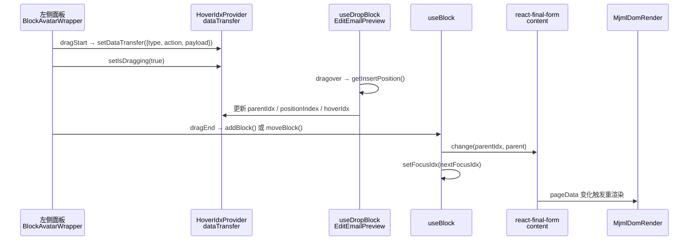
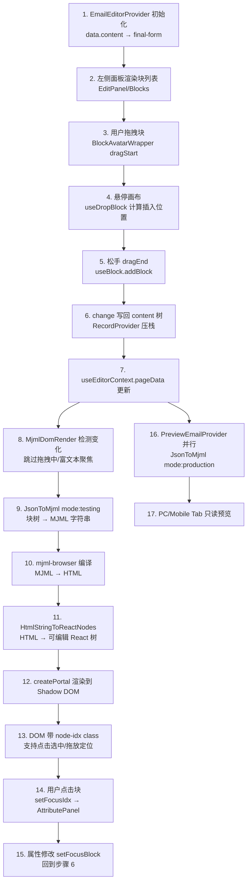
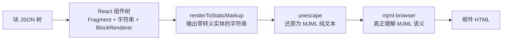

# 从左侧面板到页面渲染：完整流程详解

本文档描述用户在**左侧面板**操作块（拖拽、选中、编辑属性）后，编辑器如何将块 JSON 树渲染到**中间画布**的完整链路，涵盖关键代码位置与数据流向。

---

## 1. 架构总览

编辑器由三个核心包协作：

| 包 | 路径 | 职责 |
|---|---|---|
| `email-editor-editor` | `packages/email-editor-editor/` | 核心引擎：表单状态、画布、拖放、预览 Provider |
| `email-editor-preset` | `packages/email-editor-preset/` | 预设 UI：左侧面板、图层树、快捷工具栏、属性面板 |
| `email-editor-blocks-react` | `packages/email-editor-blocks-react/` | 块定义、块注册表、`JsonToMjml` 序列化、MJML React 渲染树 |

Demo 入口：`demo/src/pages/Editor/index.tsx`  
典型组装方式：

```
EmailEditorProvider
  └─ StandardLayout（左 EditPanel + 中 EmailEditor）
       └─ EmailEditor（EDIT / PC / MOBILE 三个 Tab）
```

---

## 2. 数据模型：块 JSON 树存在哪里

### 2.1 表单根状态

`EmailEditorProvider` 使用 **react-final-form** 管理整封邮件模板：

```typescript
// packages/email-editor-editor/src/typings/index.ts
interface IEmailTemplate {
  content: IPage;   // 块 JSON 树根节点（Page 类型）
  subject: string;
  subTitle: string;
}
```

初始化时把外部传入的 `data.content` 写入表单：

```34:40:packages/email-editor-editor/src/components/Provider/EmailEditorProvider/index.tsx
  const initialValues = useMemo(() => {
    return {
      subject: data.subject,
      subTitle: data.subTitle,
      content: data.content,
    };
  }, [data.subject, data.subTitle, data.content]);
```

### 2.2 pageData 即 content

`useEditorContext` 把表单中的 `content` 字段暴露为 `pageData`：

```6:17:packages/email-editor-editor/src/hooks/useEditorContext.ts
export function useEditorContext() {
  const formState = useFormState<IEmailTemplate>();
  const helpers = useForm();
  const { initialized, setInitialized } = useContext(BlocksContext);
  const { content } = formState.values;
  return {
    formState,
    formHelpers: helpers,
    initialized,
    setInitialized,
    pageData: content,
  };
}
```

### 2.3 块的索引路径（idx）

每个块在 JSON 树中有唯一路径，由 `packages/email-editor-shared/src/tree/` 中的工具函数维护：

| 函数 | 示例 |
|---|---|
| `getPageIdx()` | `'content'`（根 Page 节点） |
| `getChildIdx(parentIdx, index)` | `'content.children.[0]'` |
| `getValueByIdx(values, idx)` | 按路径读取块 JSON |

子块嵌套示例：

```
content                                    ← Page 根
  └─ children.[0]                          ← Section
       └─ children.[0]                      ← Column
            └─ children.[0]                ← Text
```

### 2.4 Provider 层级

由外到内的 Context 树（`EmailEditorProvider/index.tsx`）：

```
Form (react-final-form)
  └─ PropsProvider
      └─ LanguageProvider
          └─ PreviewEmailProvider      ← PC/移动端预览 HTML（production 模式）
              └─ RecordProvider        ← 撤销/重做栈
                  └─ BlocksProvider    ← focusIdx、activeTab
                      └─ HoverIdxProvider  ← 拖放/悬停状态
                          └─ ScrollProvider
                              └─ FocusBlockLayoutProvider  ← 选中块 DOM 节点
```

**UI 交互状态**（`focusIdx`、拖放中、悬停）存在 React Context；**块 JSON 树**完全在 react-final-form 中，无独立 Redux/Zustand。

---

## 3. 左侧面板：块从哪里来

### 3.1 布局结构

**StandardLayout**（Demo 默认使用）  
文件：`packages/email-editor-preset/src/StandardLayout/StandardLayout.tsx`

```
┌─────────────────┬──────────────────────────┬──────────────┐
│  EditPanel      │  EmailEditor（画布）      │  右侧 Sider  │
│  宽 360px       │  EDIT / PC / MOBILE Tab  │  （可选）    │
└─────────────────┴──────────────────────────┴──────────────┘
```

**EditPanel** 文件：`packages/email-editor-preset/src/EditPanel/index.tsx`

Tab 结构：
- **块** → `<Blocks />`：分类可拖拽块列表
- **层级** → `<BlockLayer />`：树形图层
- **配置 / 源码**（`left-overlay` 模式下按选中状态切换）

面板根节点带 `data-email-editor-sidebar` 属性，画布点击时会忽略该区域，避免误清富文本焦点。

### 3.2 Blocks 面板（分类块列表）

文件：`packages/email-editor-preset/src/EditPanel/Blocks/index.tsx`

- 分类数据来自 `ExtensionProvider` 的 `categories`（`StandardLayout` 提供默认分类：内容、布局等）
- 每个块项用 `BlockAvatarWrapper` 包裹，设置 `draggable`
- 布局类块（2/3/4 栏）会预构造 `SECTION + COLUMN[]` 的 payload

```tsx
// 每个块项的核心结构
<BlockAvatarWrapper type={type} payload={payload}>
  <div className={styles.blockItemContainer}>
    <IconFont icon={getBlockTypeIcon(type)} />
    <Typography.Text>{title || block?.name}</Typography.Text>
  </div>
</BlockAvatarWrapper>
```

### 3.3 其他左侧入口

| 组件 | 文件 | 作用 |
|---|---|---|
| `BlockLayer` | `packages/email-editor-preset/src/BlockLayer/index.tsx` | 图层树：点击选中、树内拖放移动 |
| `ShortcutToolbar` | `packages/email-editor-preset/src/ShortcutToolbar/ShortcutToolbar.tsx` | 左侧竖条快捷图标 |
| `BlocksPanel` | `packages/email-editor-preset/src/ShortcutToolbar/components/BlocksPanel/index.tsx` | 点击展开的完整块市场浮层 |
| `AttributePanel` | `packages/email-editor-preset/src/AttributePanel/AttributePanel.tsx` | 属性编辑（右侧面板或浮层） |

### 3.4 属性编辑如何回写 JSON

属性面板通过 `useFocusBlockData` 读取当前 `focusIdx` 对应的块 JSON，修改后调用 `useBlock().setFocusBlock` / `setValueByIdx`（debounce 300ms），最终 `change(idx, newBlockData)` 写回 final-form，触发画布重渲染。

---

## 4. 拖拽插入：从左侧面板到 JSON 树

### 4.1 统一拖拽封装：BlockAvatarWrapper

文件：`packages/email-editor-editor/src/components/wrapper/BlockAvatarWrapper/index.tsx`

所有可拖拽块（左侧面板、快捷工具栏、画布内移动手柄）都通过此组件封装。

**拖拽开始（dragStart）**：写入 `HoverIdxProvider` 的 `dataTransfer`：

```35:58:packages/email-editor-editor/src/components/wrapper/BlockAvatarWrapper/index.tsx
  const onDragStart = useCallback(
    (ev: React.DragEvent) => {
      if (action === 'add') {
        setDataTransfer({
          type: type,
          action,
          payload,
        });
      } else {
        setDataTransfer({
          type: type,
          action,
          sourceIdx: idx,
        });
      }
      // ...设置拖拽预览图
      setIsDragging(true);
    },
```

- `action='add'`：从左侧面板拖入新块
- `action='move'`：画布上已有块的移动（`FocusTooltip` 提供移动手柄）

**拖拽结束（dragEnd）**：根据 `dataTransfer` 中的插入位置调用 `addBlock` 或 `moveBlock`：

```72:89:packages/email-editor-editor/src/components/wrapper/BlockAvatarWrapper/index.tsx
    if (action === 'add' && !isUndefined(transfer.parentIdx)) {
      addBlock({
        type,
        parentIdx: transfer.parentIdx,
        positionIndex: transfer.positionIndex,
        payload,
      });
    } else if (
      idx &&
      !isUndefined(transfer.sourceIdx) &&
      !isUndefined(transfer.parentIdx) &&
      !isUndefined(transfer.positionIndex)
    ) {
      moveBlock(
        transfer.sourceIdx,
        getChildIdx(transfer.parentIdx, transfer.positionIndex),
      );
    }
```

### 4.2 画布拖放监听：useDropBlock

文件：`packages/email-editor-editor/src/hooks/useDropBlock.ts`

`EditEmailPreview` 把画布容器 ref 传给 `useDropBlock`：

```22:24:packages/email-editor-editor/src/components/EmailEditor/components/EditEmailPreview/index.tsx
  useEffect(() => {
    setRef(containerRef);
  }, [containerRef, setRef]);
```

**dragover 阶段**（悬停时实时计算插入位置）：

1. `getBlockNodeByChildEle(ev.target)` — 从鼠标位置向上找最近的块 DOM 节点
2. `getNodeIdxFromClassName(blockNode.classList)` — 从 class 解析 idx（如 `node-idx-content.children.[0]`）
3. `getDirectionPosition(ev)` — 判断上/下/左/右方向
4. `getInsertPosition()`（`packages/email-editor-editor/src/utils/getInsertPosition.ts`）— 计算合法的 `parentIdx` 和 `positionIndex`
5. 同步更新 `dataTransfer.parentIdx / positionIndex`（**必须同步**，`useDataTransfer` 中有相关注释）

**pointerdown 阶段**（点击选中，非拖放）：

```37:50:packages/email-editor-editor/src/hooks/useDropBlock.ts
      const selectBlockFromEvent = (ev: Event) => {
        if (!(ev.target instanceof Element)) return;
        const blockNode = getBlockNodeByChildEle(ev.target);
        if (!blockNode) return;
        const idx = getNodeIdxFromClassName(blockNode.classList);
        if (!idx) return;
        setFocusIdx(idx);
        notifyFocusSelection();
      };
```

### 4.3 写入 JSON 树：useBlock.addBlock

文件：`packages/email-editor-editor/src/hooks/useBlock.ts`

```45:120:packages/email-editor-editor/src/hooks/useBlock.ts
  const addBlock = useCallback(
    (params: { type, parentIdx, positionIndex?, payload?, canReplace? }) => {
      // 1. 深拷贝当前表单值
      const values = cloneDeep(getState().values);

      // 2. 按 type 创建块 JSON（createBlockDataByType）
      let child = createBlockDataByType(type, payload);

      // 3. 可选 autoComplete：自动包裹中间容器（如 Button 自动放入 Column）
      if (autoComplete) { /* getAutoCompletePath → 逐层包裹 */ }

      // 4. 校验 validParentType（子块类型是否允许在该父块下）
      if (!fixedBlock?.validParentType.includes(parent.type)) return;

      // 5. 插入到 parent.children
      parent.children.splice(positionIndex, 0, child);

      // 6. 写回表单 + 聚焦新块 + 滚动到视图
      change(parentIdx, parent);
      setFocusIdx(nextFocusIdx);
      scrollBlockEleIntoView({ idx: nextFocusIdx });
    },
```

**撤销/重做**：`RecordProvider`（`packages/email-editor-editor/src/components/Provider/RecordProvider/index.tsx`）监听 `formState` 变化，将 `cloneDeep(values)` 压入栈（最多 50 条）。

### 4.4 拖拽完整时序



---

## 5. 渲染管线：JSON 树 → 画布 DOM

### 5.1 EmailEditor 三个 Tab

文件：`packages/email-editor-editor/src/components/EmailEditor/index.tsx`

| Tab | 组件 | 渲染模式 |
|---|---|---|
| **EDIT** | `EditEmailPreview` | `mode: 'testing'`，可编辑画布 |
| **PC** | `DesktopEmailPreview` | `mode: 'production'`，只读预览 |
| **MOBILE** | `MobileEmailPreview` | 同上，窄屏 |

### 5.2 编辑画布组件树

```
EditEmailPreview
  └─ SyncScrollShadowDom（Shadow DOM，隔离 MJML 样式）
      └─ div[ref=containerRef]  ← useDropBlock 挂载点，data-drop-container="true"
          └─ MjmlDomRender     ← 编辑模式渲染核心
              └─ createPortal → HtmlStringToReactNodes(compiledHtml)
      └─ ShadowStyle
```

`EditEmailPreview` 文件：`packages/email-editor-editor/src/components/EmailEditor/components/EditEmailPreview/index.tsx`

### 5.3 MjmlDomRender：编辑模式渲染核心

文件：`packages/email-editor-editor/src/components/EmailEditor/components/EditEmailPreview/components/MjmlDomRender.tsx`

#### 步骤 A：订阅表单数据，带节流保护

```23:46:packages/email-editor-editor/src/components/EmailEditor/components/EditEmailPreview/components/MjmlDomRender.tsx
  const { pageData: content } = useEditorContext();
  const [pageData, setPageData] = useState<IPage | null>(() =>
    content ? cloneDeep(content) : null,
  );
  // ...
  useEffect(() => {
    if (!content) return;
    // 拖拽中或富文本聚焦时跳过重同步，避免打断用户输入
    if (!isTextFocus && !isDragging) {
      if (!isEqual(content, pageData)) {
        setPageData(cloneDeep(content));
        setRenderVersion((v) => v + 1);
      }
    }
  }, [content, pageData, isTextFocus, isDragging]);
```

#### 步骤 B：JSON → MJML → HTML

```111:137:packages/email-editor-editor/src/components/EmailEditor/components/EditEmailPreview/components/MjmlDomRender.tsx
  const html = useMemo(() => {
    if (!pageData) return '';

    const mjmlString = JsonToMjml({
      data: pageData,
      idx: getPageIdx(),
      context: pageData,
      mode: 'testing',          // 编辑模式
      dataSource: cloneDeep(mergeTags),
    });
    const compiledHtml = mjml(mjmlString).html;
    return compiledHtml;
  }, [mergeTags, pageData]);
```

#### 步骤 C：HTML → React 节点，portal 到 Shadow DOM

```139:164:packages/email-editor-editor/src/components/EmailEditor/components/EditEmailPreview/components/MjmlDomRender.tsx
        {ref &&
          createPortal(
            HtmlStringToReactNodes(html, {
              enabledMergeTagsBadge: Boolean(enabledMergeTagsBadge),
            }),
            ref,
          )}
```

### 5.4 JsonToMjml：JSON 树 → MJML 字符串

文件：`packages/email-editor-blocks-react/src/JsonToMjml.tsx`

> **常见疑问**：`block.render()` 输出的是 React 树，但 React 并不认识 MJML 标签——详见 [§10 常见问题](#10-常见问题render-时会转成-react-树但-react-认识-mjml-标签吗)。

```
options.data（Page 根节点）
  │
  ├─ getBlockByType(data.type)          查块定义（IBlock）
  │
  ├─ EmailRenderProvider                注入 mode / context / dataSource
  │     └─ block.render(options)      根块开始渲染
  │           └─ BlockRenderer          递归渲染每个子块
  │                 └─ 各块 render()    输出 MJML 标签（React 树）
  │
  ├─ renderToStaticMarkup()             服务端 React 渲染为 HTML 字符串
  │
  ├─ unescape()                         还原被 React 转义的 < > & 等实体
  │
  └─ beautify?（可选）                  js-beautify 格式化
```

**BlockRenderer**（递归入口）  
文件：`packages/email-editor-blocks-react/src/mjml/BlockRenderer.tsx`

```11:17:packages/email-editor-blocks-react/src/mjml/BlockRenderer.tsx
export const BlockRenderer = (props: BlockDataItem) => {
  const { data } = props;
  const { mode, context, dataSource } = useEmailRenderContext();
  if (data.data.hidden) return null;
  const block = resolveRenderBlock(data.type);
  if (!block) return null;
  return <>{block.render({ ...props, mode, context, dataSource })}</>;
};
```

**Page 块渲染示例**（拼出 `<mjml>` 骨架，子节点交给 BlockRenderer）  
文件：`packages/email-editor-blocks-react/src/plugins/standard/page/renderer.tsx`

```46:94:packages/email-editor-blocks-react/src/plugins/standard/page/renderer.tsx
    return (
      <>
        {`<mjml><mj-head>...${metaData}...</mj-head><mj-body ${getAdapterAttributesString(params)}>`}

        {data.children.map((child, index) => (
          <BlockRenderer
            {...params}
            idx={getChildIdx(getPageIdx(), index)}
            key={index}
            data={child}
          />
        ))}

        {'</mj-body></mjml>'}
      </>
    );
```

**通用 MJML 标签块**（Text、Image 等大多走 `BasicBlock`）  
文件：`packages/email-editor-blocks-react/src/mjml/BasicBlock.tsx`

- 用 `getAdapterAttributesString` 拼 MJML 属性字符串
- `testing` 模式下空图片 URL 显示占位图
- 有子块时递归 `BlockRenderer`

### 5.5 testing 模式的关键：idx className

文件：`packages/email-editor-blocks-react/src/utils/getAdapterAttributesString.ts`

编辑模式下，每个 MJML 标签会附加编辑器专用 CSS class，使画布能反向定位块：

```17:24:packages/email-editor-blocks-react/src/utils/getAdapterAttributesString.ts
  if (isTest && idx) {
    attributes['css-class'] = classnames(
      attributes['css-class'],
      EMAIL_BLOCK_CLASS_NAME,           // 'email-block'
      getNodeIdxClassName(idx),         // 'node-idx-content.children.[0]'
      getNodeTypeClassName(data.type)   // 'node-type-advanced_text'
    );
  }
```

`mjml-browser` 编译后，这些 class 会出现在最终 HTML 的 DOM 节点上，`useDropBlock` 通过 `getNodeIdxFromClassName` 反查 idx，实现点击选中和拖放定位。

### 5.6 HtmlStringToReactNodes：HTML → 可编辑 React 树

文件：`packages/email-editor-editor/src/utils/HtmlStringToReactNodes.tsx`

1. `DOMParser` 解析编译后的 HTML
2. 遍历 DOM，识别 `node-idx-*` / `node-type-*` class
3. 为文本、按钮、导航等块注入 `contenteditable` 属性
4. 支持合并标签 Badge 渲染
5. 用户直接在画布修改文本时，通过 contenteditable 逻辑回写 `setFocusBlock`

预览 Tab 使用 **`HtmlStringToPreviewReactNodes`**（只读，无 contenteditable）  
文件：`packages/email-editor-editor/src/utils/HtmlStringToPreviewReactNodes.tsx`

### 5.7 画布叠加层：InteractivePrompt

文件：`packages/email-editor-preset/src/InteractivePrompt/`

在 Shadow DOM 上方叠加：
- `FocusTooltip` — 选中块的操作手柄（移动、复制、删除）
- `HoverTooltip` — 拖放时的插入位置指示线

`FocusTooltip` 内的移动手柄同样是 `BlockAvatarWrapper action='move' idx={focusIdx}`。

---

## 6. PC/移动端预览（并行管线）

### 6.1 PreviewEmailProvider

文件：`packages/email-editor-editor/src/components/Provider/PreviewEmailProvider/index.tsx`

与编辑画布**并行**监听 `pageData`（经 `useLazyState` 节流），使用 **`mode: 'production'`**：

```62:73:packages/email-editor-editor/src/components/Provider/PreviewEmailProvider/index.tsx
    const mjmlString = JsonToMjml({
      data: cloneData,
      mode: 'production',
      context: cloneData,
      dataSource: cloneDeep(injectData),
      keepClassName: true,
    });
    let parseHtml = mjml(mjmlString).html;
```

输出通过 `PreviewEmailContext` 提供给 `DesktopEmailPreview` / `MobileEmailPreview`。

### 6.2 编辑预览 vs 生产预览 vs 导出

| 维度 | 编辑模式 (`testing`) | 生产/预览/导出 (`production`) |
|---|---|---|
| 调用方 | `MjmlDomRender` | `PreviewEmailProvider`、`SourceCodePanel`、Demo 导出 |
| CSS class | 每块加 `email-block`、`node-idx-*`、`node-type-*` | 不加 idx class（`keepClassName` 可保留类型 class） |
| 图片 | 空 URL / 合并标签 URL 显示占位图 | 原样输出 |
| HTML→React | `HtmlStringToReactNodes`（可编辑） | `HtmlStringToPreviewReactNodes`（只读） |
| 渲染容器 | Shadow DOM + portal | Shadow DOM（预览 Tab）/ 剪贴板+文件（导出） |
| `idx` 参数 | 必须传 `idx: getPageIdx()` | 可选 |

Demo 导出示例（`demo/src/pages/Editor/index.tsx`）：

```typescript
// MJML 导出
JsonToMjml({ data: values.content, mode: 'production', context: values.content })

// HTML 导出 = 上述 MJML + mjml-browser 编译
```

---

## 7. 端到端完整流程（一步不漏）



### 逐步说明

1. **初始化**：`EmailEditorProvider` 用 `data.content`（`IPage` JSON 树）初始化 final-form
2. **左侧面板展示块**：`EditPanel/Blocks` 或 `ShortcutToolbar` 渲染可拖拽 UI
3. **用户拖拽**：`BlockAvatarWrapper.onDragStart` → `HoverIdxProvider.dataTransfer`
4. **悬停画布**：`useDropBlock` + `getInsertPosition` 实时更新插入位置
5. **松手**：`BlockAvatarWrapper.onDragEnd` → `useBlock.addBlock` → `change(parentIdx)` 更新 `content` 树
6. **表单变化**：`useEditorContext().pageData` 更新；`RecordProvider` 压栈
7. **编辑画布重渲染**：`MjmlDomRender` 检测 `content` 变化 → `JsonToMjml(mode:'testing')` → `mjml-browser` → `HtmlStringToReactNodes` → Shadow DOM portal
8. **DOM 带 idx class**：`node-idx-content.children.[n]` 使 `useDropBlock` 能反向定位块
9. **选中块**：点击画布 → `setFocusIdx` → `AttributePanel` 显示对应配置 → 修改走 `setFocusBlock` → 回到步骤 6
10. **PC/移动预览**：`PreviewEmailProvider` 并行监听 `pageData` → `JsonToMjml(mode:'production')` → `DesktopEmailPreview` 展示
11. **导出**：Demo 直接从 `values.content` 调 `JsonToMjml(production)` + `mjml()`，不经编辑画布 DOM

---

## 8. 关键文件索引

### 左侧面板 / 拖放

| 文件 | 组件/函数 | 作用 |
|---|---|---|
| `packages/email-editor-preset/src/EditPanel/index.tsx` | `EditPanel` | 左侧 Tab 容器 |
| `packages/email-editor-preset/src/EditPanel/Blocks/index.tsx` | `Blocks` | 分类块列表 + 拖拽源 |
| `packages/email-editor-preset/src/BlockLayer/index.tsx` | `BlockLayer` | 图层树 + 树内拖放 |
| `packages/email-editor-preset/src/ShortcutToolbar/ShortcutToolbar.tsx` | `ShortcutToolbar` | 快捷拖拽工具栏 |
| `packages/email-editor-editor/src/components/wrapper/BlockAvatarWrapper/index.tsx` | `BlockAvatarWrapper` | 统一拖拽封装（add/move） |
| `packages/email-editor-editor/src/hooks/useDropBlock.ts` | `useDropBlock` | 画布拖放监听 + 点击选中 |
| `packages/email-editor-editor/src/utils/getInsertPosition.ts` | `getInsertPosition` | 计算插入 parentIdx/index |
| `packages/email-editor-preset/src/InteractivePrompt/components/FocusTooltip.tsx` | `FocusTooltip` | 画布内移动手柄 |

### 状态管理

| 文件 | 组件/函数 | 作用 |
|---|---|---|
| `packages/email-editor-editor/src/components/Provider/EmailEditorProvider/index.tsx` | `EmailEditorProvider` | Form 根 + Provider 树 |
| `packages/email-editor-editor/src/components/Provider/BlocksProvider/index.tsx` | `BlocksProvider` | `focusIdx`、`activeTab` |
| `packages/email-editor-editor/src/components/Provider/HoverIdxProvider/index.tsx` | `HoverIdxProvider` | 拖放/悬停状态 |
| `packages/email-editor-editor/src/components/Provider/RecordProvider/index.tsx` | `RecordProvider` | 撤销/重做 |
| `packages/email-editor-editor/src/hooks/useBlock.ts` | `useBlock` | 块 CRUD API |
| `packages/email-editor-editor/src/hooks/useEditorContext.ts` | `useEditorContext` | `pageData` = `content` |
| `packages/email-editor-shared/src/tree/index.ts` | `getPageIdx` 等 | idx 路径工具 |

### 渲染 / 预览

| 文件 | 组件/函数 | 作用 |
|---|---|---|
| `packages/email-editor-editor/src/components/EmailEditor/index.tsx` | `EmailEditor` | 三 Tab 容器 |
| `packages/email-editor-editor/src/components/EmailEditor/components/EditEmailPreview/index.tsx` | `EditEmailPreview` | 编辑画布壳 + Shadow DOM |
| `packages/email-editor-editor/src/components/EmailEditor/components/EditEmailPreview/components/MjmlDomRender.tsx` | `MjmlDomRender` | 编辑模式渲染核心 |
| `packages/email-editor-editor/src/components/Provider/PreviewEmailProvider/index.tsx` | `PreviewEmailProvider` | 生产模式预览 HTML |
| `packages/email-editor-blocks-react/src/JsonToMjml.tsx` | `JsonToMjml` | JSON 树 → MJML 字符串 |
| `packages/email-editor-blocks-react/src/mjml/BlockRenderer.tsx` | `BlockRenderer` | 递归块渲染 |
| `packages/email-editor-blocks-react/src/mjml/BasicBlock.tsx` | `BasicBlock` | 通用 MJML 标签渲染 |
| `packages/email-editor-blocks-react/src/utils/getAdapterAttributesString.ts` | `getAdapterAttributesString` | testing/production class 分支 |
| `packages/email-editor-editor/src/utils/HtmlStringToReactNodes.tsx` | `HtmlStringToReactNodes` | 编辑模式 HTML→React |
| `packages/email-editor-editor/src/utils/HtmlStringToPreviewReactNodes.tsx` | `HtmlStringToPreviewReactNodes` | 预览模式 HTML→React |

### 块引擎

| 文件 | 作用 |
|---|---|
| `packages/email-editor-blocks-react/src/createBlockDataByType.ts` | 按 type 创建默认块 JSON |
| `packages/email-editor-blocks-react/src/blockRegistry.ts` | 块注册表 |
| `packages/email-editor-blocks-react/src/render/context.tsx` | `EmailRenderProvider` / `useEmailRenderContext` |
| `packages/email-editor-blocks-react/src/plugins/standard/*/renderer.tsx` | 各标准块的 MJML 渲染实现 |
| `packages/email-editor-blocks-react/src/jsonToMjmlOptions.ts` | `testing` / `production` 类型定义 |

---

## 9. 补充说明

- **`pageData` 有两层含义**：`useEditorContext().pageData` 是表单实时值；`MjmlDomRender` 内部还有一份本地 `pageData` 状态，用于拖拽/富文本聚焦时的渲染节流。
- **`focusIdx` 默认值**：`BlocksProvider` 初始为 `getPageIdx()`（`'content'`），即选中整页。
- **属性面板与画布双向绑定**：面板改 JSON → form 变 → 重渲染；画布 contenteditable 改文本 → 也通过 `setFocusBlock` 回写 JSON。
- **性能埋点**：`MjmlDomRender` 和 `PreviewEmailProvider` 中对 `jsonToMjml`、`mjmlCompile`、`htmlToReact` 各阶段有 `perfTime` / `perfReport` 计时，详见 `docs/PERF_BASELINE.md`。

---

## 10. 常见问题：render 时会转成 React 树，但 React 认识 MJML 标签吗？

### 问题

`block.render()` 会输出 React 树，但 React 认识 `mj-text`、`mj-button` 这类 MJML 标签吗？

### 答案：不认识，也不需要认识

React 对 `mj-text`、`mj-button` 等标签**没有任何内置语义**。本项目也**没有**把它们当成真正的 JSX 组件来用，而是把 MJML 标签写成**普通字符串**，借 React 组件树做递归遍历和条件拼装，最终输出 MJML 纯文本，再交给 `mjml-browser` 编译。

### 实际做法：React 只是「拼装字符串」的工具

`BasicBlock` 输出的不是 `<mj-button>` 元素，而是模板字符串：

```tsx
// packages/email-editor-blocks-react/src/mjml/BasicBlock.tsx
return (
  <>
    {`<${tag} ${getAdapterAttributesString(params)}>`}
    {content || data.children.map((child, index) => (
      <BlockRenderer key={index} {...params} data={child} />
    ))}
    {`</${tag}>`}
  </>
);
```

Button 块同样走这条路：

```tsx
// packages/email-editor-blocks-react/src/plugins/standard/button/renderer.tsx
return (
  <BasicBlock params={params} tag="mj-button">
    {data.data.value.content}
  </BasicBlock>
);
```

因此 React 树的真实结构是：

```
Fragment
  ├─ 文本节点: "<mj-button css-class=...>"
  ├─ 文本节点: "点击我"          ← 按钮文案
  └─ 文本节点: "</mj-button>"
```

`BlockRenderer` 负责**递归遍历块 JSON 树**；MJML 标签本身始终是普通字符串，不是 React 元素。

### renderToStaticMarkup 之后发生了什么

`JsonToMjml` 调用 `renderToStaticMarkup`，把 React 树压成 HTML 字符串：

```tsx
// packages/email-editor-blocks-react/src/JsonToMjml.tsx
const mjmlString = unescape(
  renderToStaticMarkup(
    <EmailRenderProvider ...>
      {block.render(options)}
    </EmailRenderProvider>,
  ),
);
```

过程中 React 会把字符串里的 `<`、`>` 编码成 `&lt;`、`&gt;`，中间产物类似：

```html
&lt;mj-button css-class="email-block node-idx-..."&gt;点击我&lt;/mj-button&gt;
```

`unescape`（来自 `he` 库）再把它还原成真正的 MJML：

```xml
<mj-button css-class="email-block node-idx-...">点击我</mj-button>
```

**到这一步为止，React 的工作就结束了**——产物是纯 MJML 文本字符串。

### 真正「认识」MJML 的是 mjml 编译器

在 `MjmlDomRender` 中：

```typescript
const mjmlString = JsonToMjml({ ... });
const compiledHtml = mjml(mjmlString).html;  // mjml-browser
```

`mjml-browser` 才负责解析 `<mj-button>`、`<mj-section>` 等标签，编译成邮件 HTML（`<table>`、`<td>` 等）。

### 分工示意



### React 在这里扮演什么角色

React **不是** MJML 渲染器，而是：

| 用途 | 说明 |
|------|------|
| 树形遍历 | `BlockRenderer` 递归处理 `children` |
| 条件逻辑 | `mode === 'testing'` 时图片占位、加 idx class 等 |
| Context 传递 | `EmailRenderProvider` 下发 `mode` / `dataSource` / `context` |
| 组合拼装 | 用 JSX 组织字符串片段，比纯字符串拼接更易维护 |

### 如果写成真正的 `<mj-text>` JSX 会怎样？

假如有人写：

```tsx
return <mj-text>hello</mj-text>;
```

React 会把它当成**未知自定义元素**（Web Component 风格），`renderToStaticMarkup` 可能直接输出 `<mj-text>hello</mj-text>`，不经过 `unescape` 也能用。

但本项目**刻意没这么做**，原因包括：

1. 属性是动态拼接的（`getAdapterAttributesString`），模板字符串更灵活
2. 需要混用 React 子组件（`BlockRenderer`）和 MJML 字符串
3. 统一走 `unescape` 一条路径，避免部分标签被转义、部分不被转义的混乱

### 一句话总结

**React 不认识 MJML，也不需要认识。它只是借组件树的结构把块 JSON 递归「打印」成 MJML 字符串，真正的 MJML 解析和编译交给 `mjml-browser`。**
