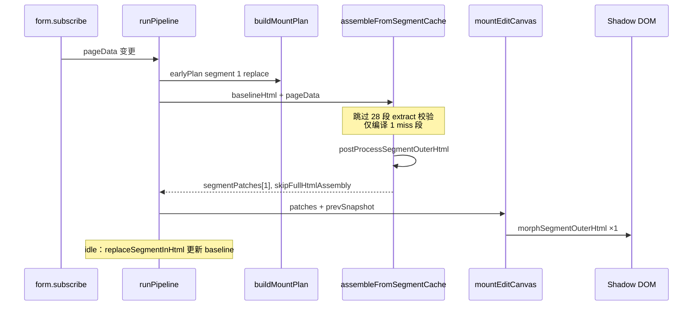

# 编辑画布 L2 段级直通挂载方案（P1）

> **状态**：方案稿，待评审  
> **目标**：改 section 背景色 / padding 等单段属性，端到端 **稳定 < 50ms**（L 档 ~29 section）  
> **关联**：[编辑画布-stableId与Worker架构方案.md](./编辑画布-stableId与Worker架构方案.md) §8.6、[编辑画布渲染优化方案.md](./编辑画布渲染优化方案.md)、`segmentAssembly.ts`、`EditCanvasMount.ts`

---

## 1. 背景与现状（2026-06-18 实测）

段级 `postProcess` 优化后，改 1 段背景色典型日志：

| 阶段 | 耗时 | 说明 |
|------|------|------|
| L2 compile | **145.8ms** | `l2Hits: 28, recomputed: 1` |
| `postProcess.segment` | **1.3ms** | 仅变更段后处理（已落地） |
| mount (`dom-segment`) | **~8ms** | plan 1.6 + morph 0.4 |
| **totalMs** | **159ms** | `[EE-Canvas:pipeline.end]` |

单段 mjml 本身很快（`jsonToMjml≈5ms + mjmlCompile≈2ms`），**瓶颈不在 mjml，而在 L2 组装路径对整页 baseline 的反复解析与拼接**。

---

## 2. 根因分析

### 2.1 当前 L2 路径（`assembleFromSegmentCache`）

```
baselineHtml (212KB)
  │
  ├─ for each of 29 segments:
  │     ├─ L2 hit? → extractSegmentOuterHtml(baseline, idx)  ← 每段可能 DOMParser 整页
  │     └─ L2 miss? → fullCompile 单段 → replaceSegmentInHtml(整页)  ← DOMParser ×2
  │
  └─ 输出 assembled 整页 html → 写入 L1
         │
         ▼
    MjmlDomRender → mountEditCanvas
         ├─ buildMountPlan → segment / 1 replace
         ├─ postProcess.segment（已优化）
         └─ commitMountPlan → morph 1 段
```

**问题**：

1. **编译层产出整页 HTML，挂载层只用 1 段**——中间 `replaceSegmentInHtml` 对 212KB 做 DOM 解析 + 序列化，约 **100–130ms** 纯开销。
2. **L2 命中校验** `extractSegmentOuterHtml(baseline, idx)` 在循环内对**每一命中段**都可能 `DOMParser.parse(整页)`，29 段模板 ≈ **28 次无效整页 parse**（与是否变更无关）。
3. `lastCompiledHtmlRef` / L1 仍要求「组装后的整页 HTML」，迫使组装在热路径同步完成。

### 2.2 已完成的优化（基线）

| 项 | 效果 |
|----|------|
| `postProcessSegmentOuterHtml` 接入 `EditCanvasMount` | postProcess 204ms → **1.3ms** |
| edit 主线程 compile | 避免 Worker 取消竞态 |
| `form.subscribe` + 48ms debounce | 侧栏属性可靠触发 |

---

## 3. 目标与原则

### 3.1 性能目标

| 场景 | 现状 | 目标 |
|------|------|------|
| 改 1 段颜色 / padding（L 档 29 section） | ~159ms | **< 50ms** |
| 改 2–3 段 | 未测 | **< 80ms** |
| 增删 section / morph-full | 不变 | 允许走慢路径 |

### 3.2 设计原则

1. **编译输出与挂载消费对齐**：mount plan 为 `segment` 且仅少量 `replace` 时，compile **不组装整页**。
2. **postProcess 前移到 compile 边界或 L2 写入时**：mount 热路径只做 `morphSegmentOuterHtml`。
3. **慢路径兜底不变**：组装失败、多段全量变更、page 级 fingerprint 变化 → 现有 `morph-full` / 全量 compile。
4. **baseline 最终一致**：允许热路径后**异步**修补 `lastCompiledHtmlRef`，不阻塞用户感知。

---

## 4. 方案概览：L2 段级直通（Segment Direct Patch）

### 4.1 核心思路

当同时满足：

- `assembleFromSegmentCache` 中 `recomputed >= 1` 且 `recomputed <= DIRECT_PATCH_MAX`（建议 **1–3**）
- `buildMountPlan` 为 `segment`，且 `replace` 段数与 `recomputed` 一致
- 无 `reorder` / `morph-full` / page fingerprint 变更

则 compile 返回 **段级补丁（SegmentPatch）**，跳过 `replaceSegmentInHtml` 与整页 `postProcess`：

```
compileWithRenderCache
  └─ assembleFromSegmentCache (fast path)
        ├─ 仅对 miss 段：fullCompile → extract raw fragment
        ├─ postProcessSegmentOuterHtml → mountOuterHtml
        └─ 返回 SegmentPatch[]（不拼接整页）

MjmlDomRender.runPipeline
  └─ mountEditCanvas({ segmentPatches, rawHtml?: baseline })
        └─ commitMountPlan(segment + 预填 outerHtml) → morph 1–3 段
```

### 4.2 数据结构（拟新增）

```ts
/** 已后处理、可直接 morph 进 live DOM 的段补丁 */
export interface SegmentDirectPatch {
  stableId: string;
  idx: string;
  subtreeHash: string;
  /** postProcess 后的 outerHTML，含 data-ee-uid / contenteditable 等 */
  mountOuterHtml: string;
}

export interface CompilePipelineResult {
  html: string;                    // 仍保留：慢路径 / L1 回填 / 异步 baseline
  hitLevel: RenderCacheHitLevel;
  segmentStats?: { ... };
  /**
   * 快路径：有值时 mount 优先用补丁，不依赖 html 与 baseline 的差异。
   * html 可为 baselineHtml（未拼接）或空占位，由 skipFullHtmlAssembly 标记。
   */
  segmentPatches?: SegmentDirectPatch[];
  skipFullHtmlAssembly?: boolean;
}

/** L2 缓存条目扩展（可选，见 §5.2） */
export interface SegmentCacheEntry {
  segmentIdx: string;
  stableId: string;
  html: string;              // raw 编译片段（现有）
  mountOuterHtml?: string;   // 已 postProcess，key 含 postProcess 选项指纹
  subtreeHash: string;
  createdAt: number;
}
```

### 4.3 端到端流程（快路径）



---

## 5. 模块改造要点

### 5.1 `assembleFromSegmentCache`（`segmentAssembly.ts`）

**快路径算法**（在循环前预扫）：

```ts
const changed = segments.filter(seg => !l2Hit(seg));
if (changed.length === 0) return { html: baselineHtml, l2Hits, recomputed: 0 };
if (changed.length > DIRECT_PATCH_MAX) return null; // 降级现有整页组装

// 快路径：不对 baseline 做 replaceSegmentInHtml
const patches: SegmentDirectPatch[] = [];
for (const seg of changed) {
  const raw = compileSegment(seg);
  const mountOuterHtml = postProcessSegmentOuterHtml(raw, seg.idx, options, pageData);
  if (!mountOuterHtml) return null;
  cache.setL2(..., { html: raw, mountOuterHtml });
  patches.push({ stableId, idx, subtreeHash, mountOuterHtml });
}
return {
  html: baselineHtml,
  l2Hits,
  recomputed: changed.length,
  segmentPatches: patches,
  skipFullHtmlAssembly: true,
};
```

**同步优化（可与快路径同 PR 或前置小 PR）**：

- L2 hit 校验：用 `prevSegmentSnapshot.hashes[stableId] === subtreeHash` 替代 `extractSegmentOuterHtml(baseline, idx)`，**消除 28 次整页 parse**。
- 仅对 `changed` 列表编译，命中段只 `l2Hits++`。

### 5.2 L2 缓存：`mountOuterHtml`

| 字段 | 用途 |
|------|------|
| `html`（raw） | L2 组装慢路径、`seedL2FromFullHtml`、调试 |
| `mountOuterHtml` | 快路径直达 mount；key 增加 `postProcessFingerprint`（mergeTagsBadge 等） |

`postProcessFingerprint` 变化时清空 L2 或 miss，避免 Badge 开关错用旧片段。

### 5.3 `compilePipeline.ts`

- 识别 `assembled.skipFullHtmlAssembly` → `CompilePipelineResult.segmentPatches`
- **L1 写入策略**：
  - **方案 A（推荐）**：快路径**不写 L1**，仅更新 L2；L1 在 idle baseline 修补后写入。
  - **方案 B**：写 L1 但 `html` 仍为 baseline，依赖 `segmentPatches` 供 mount；下次 L1 hit 前需修补 baseline（易错，不推荐）。

### 5.4 `mountEditCanvas` / `MjmlDomRender`

```ts
mountEditCanvas({
  rawHtml: compiledHtml,
  segmentPatches: compileResult.segmentPatches,
  pageData,
  ...
})
```

- 若 `segmentPatches?.length`：`resolvePlanWithPostProcess` **跳过**；直接将 patches 填入 `plan.segments[].outerHtml`。
- `buildMountPlan` 仍跑一遍（校验 replace 与 patches 一致）；不一致 → 降级 `morph-full`。
- `lastMountedHtmlRef`：快路径可用 `baseline + patch` 逻辑标记 dirty，或 idle 后再对齐。

### 5.5 `lastCompiledHtmlRef` 异步修补

快路径挂载完成后，用户已看到正确 DOM，后台：

```ts
requestIdleCallback(() => {
  let html = lastCompiledHtmlRef.current;
  for (const p of patches) {
    html = replaceSegmentInHtml(html, p.idx, p.rawHtml) ?? html;
  }
  lastCompiledHtmlRef.current = html;
  renderCache.setL1(...);
}, { timeout: 500 });
```

保证**下一帧交互不等待**，下一轮 L2 baseline 在 idle 前仍可用「旧 baseline + L2 raw 片段」逻辑（仅 miss 段重新 extract）。

---

## 6. 触发条件与降级

### 6.1 走快路径（全部满足）

| # | 条件 |
|---|------|
| 1 | `profile === 'edit'` |
| 2 | `recomputed >= 1 && recomputed <= 3` |
| 3 | `buildMountPlan.mode === 'segment'` |
| 4 | plan 中 `replace` 段数 === `recomputed` |
| 5 | 每个 replace 段在 live DOM 上 `findElementByStableIdInRoot` 可定位 |
| 6 | `postProcessSegmentOuterHtml` 全部成功 |

### 6.2 降级为现有慢路径

| 场景 | 降级 |
|------|------|
| 增删 section（uid 集合变） | `morph-full` |
| reorder | 零编译 reorder（已实现） |
| `recomputed > 3` | 整页 `assembleFromSegmentCache` + replace |
| page fingerprint 变、page 级属性 | `morph-full` |
| patch 与 plan 不一致 | `morph-full` |
| postProcess 失败 | `morph-full` |

---

## 7. 预期性能（改 1 段颜色）

| 步骤 | 现状 | 快路径预期 |
|------|------|------------|
| L2 循环 + hit 校验 | ~80–100ms | **< 2ms**（hash 比较，无 DOMParser） |
| 单段 compile | ~7ms | ~7ms |
| postProcess.segment | ~1.3ms | ~1.3ms（可在 compile 内一并完成） |
| replaceSegmentInHtml | ~100ms+ | **0**（跳过） |
| mount morph | ~8ms | ~8ms |
| **合计** | **~159ms** | **~20–35ms** |

留足余量仍可达 **< 50ms** 目标。

---

## 8. 实施分期（建议 PR 拆分）

### PR-P1a：L2 循环减负（小，可独立合并）

- [ ] hit 校验改为 `prevSnapshot.hashes[uid]` 或 L2 entry 存在性，去掉循环内 `extractSegmentOuterHtml(baseline)`
- [ ] 埋点：`assemble.segmentScanMs` / `assemble.replaceMs`

**预期**：159ms → **~60–80ms**（不改 mount 接口）

### PR-P1b：SegmentDirectPatch 快路径

- [ ] `SegmentDirectPatch` 类型与 `CompilePipelineResult` 扩展
- [ ] `assembleFromSegmentCache` 快路径 + `skipFullHtmlAssembly`
- [ ] `mountEditCanvas` 消费 `segmentPatches`
- [ ] `MjmlDomRender` 传递 patches；`pipeline.end` 埋点 `directPatch: true`

### PR-P1c：L2 `mountOuterHtml` 缓存 + idle baseline

- [ ] `SegmentCacheEntry.mountOuterHtml`
- [ ] `postProcessFingerprint` 进 L2 key
- [ ] `requestIdleCallback` 修补 `lastCompiledHtmlRef` + L1

### PR-P1d：文档与 PERF_BASELINE

- [ ] 更新 `PERF_BASELINE.md` 场景「改 1 段背景」目标 < 50ms
- [ ] `三级缓存说明.md` 补充快路径章节

---

## 9. 风险与对策

| 风险 | 对策 |
|------|------|
| baseline 与 live DOM 短期不一致 | idle 修补 + 超时强制 full assemble；Undo 走 form.reset 全量刷新 |
| mergeTagsBadge 切换导致片段陈旧 | L2 key 含 `postProcessFingerprint` |
| 多段同时变更超阈值 | `DIRECT_PATCH_MAX=3`，超出走慢路径 |
| L1 hit 返回未修补 baseline | 快路径不写 L1，或写前必须 patch 完成 |
| 与 Preview 缓存污染 | `profile` 已在 L1/L2 key；`mountOuterHtml` 仅 edit postProcess |

---

## 10. 验收标准

### 10.1 功能

- [ ] 改 section 背景 / padding / 边框：画布与预览一致
- [ ] 连续改同一 section 10 次：无 DOM 漂移、focus 框正常
- [ ] Undo/Redo：正确恢复
- [ ] 增删 section、move reorder：行为与现网一致

### 10.2 性能（L 档 Shop Newsletter，29 section）

```js
// 控制台过滤
window.__EE_PERF__.entries.filter(e => e.tag === 'MjmlDomRender.pipeline')
```

| 指标 | 目标 |
|------|------|
| `pipelineMs`（L2, recomputed=1） | **< 30ms** |
| `postProcess.segment` 或并入 compile | **< 5ms** |
| `MjmlDomRender.mount` total | **< 15ms** |
| `pipeline.end totalMs` | **< 50ms**（跨 5 次中位数） |

### 10.3 埋点

- `[EE-Perf:RenderCache.pipeline] directPatch: true`
- `[EE-Canvas:compile.L2-direct]` `{ patchCount, scanMs, compileMs }`
- `[EE-Canvas:baseline.idlePatch]` 异步修补耗时

---

## 11. 与现有架构的关系

```
stableId 体系（uid 定位）
    ↓
buildMountPlan（segment / reorder / morph-full）
    ↓
compile L1/L2/L3  ←── 本文档优化 L2「组装 → 直通 patch」
    ↓
postProcess（段级）←── 已完成
    ↓
commitMountPlan（morph）
```

Worker 回归 edit 后，快路径仍成立：**Worker 只负责产出 raw segment fragment**，`postProcess + morph` 仍在主线程；`segmentPatches` 可作为 Worker → Main 的消息载荷。

---

## 12. 变更记录

| 日期 | 说明 |
|------|------|
| 2026-06-18 | 初稿：基于改色 159ms 实测，定义 SegmentDirectPatch 快路径与 PR 拆分 |
| 2026-06-18 | 落地 PR-P1a/P1b：L2 扫描减负 + 直通 patch；补充 §13 正确性 |

---

## 13. 正确性：跳过整页组装后 JSON 与页面是否一致？

### 13.1 跳过的操作（快路径）

| 操作 | 说明 |
|------|------|
| 循环内 `extractSegmentOuterHtml(baseline)` 命中校验 | 改为 L2 key + `subtreeHash` 判断 |
| `replaceSegmentInHtml(整页 baseline)` | 不拼接 212KB 字符串 |
| 同步写 L1 整页 html | 延后至 idle baseline 修补 |
| 整页 `postProcessEmailHtml` | 已由段级 `postProcess.segment` 替代 |

### 13.2 不跳过的操作

| 操作 | 说明 |
|------|------|
| `rebuildPageForSegment` + `fullCompileToHtml` | 与慢路径相同的 JsonToMjml + mjml |
| `postProcessSegmentOuterHtml` | 注入 uid / contenteditable / data-selector |
| `buildMountPlan` | subtreeHash / uid 决策 |
| `morphSegmentOuterHtml` | 写入 Shadow DOM |

### 13.3 对用户可见画布：等价性

快路径下，变更段 DOM 来自：

```
JSON（变更段子树）
  → rebuildPageForSegment
  → JsonToMjml + mjml（与慢路径相同）
  → postProcessSegmentOuterHtml（与慢路径段级 postProcess 相同）
  → morph 进 live DOM
```

未变更段：**live DOM 不动**（`subtreeHash` 未变）。

与慢路径「整页组装 → 再 segment mount」相比，**mount 输入一致，DOM 结果应对齐**。

### 13.4 不能保证等价的场景（必须降级）

| 场景 | 处理 |
|------|------|
| Page 级属性变更 | `pageFingerprint` → morph-full |
| 增删 section | uid 集合变 → morph-full |
| reorder | 零编译 reorder |
| 变更段 > `L2_DIRECT_PATCH_MAX` | 整页 `replaceSegmentInHtml` |
| patch 与 plan 不一致 | morph-full |
| postProcess 失败 | morph-full |

### 13.5 内部缓存滞后（非用户可见）

| 状态 | 快路径行为 | 对策 |
|------|------------|------|
| `lastCompiledHtmlRef` | 热路径可能仍为旧 baseline | `requestIdleCallback` 异步 `replaceSegmentInHtml` 修补 |
| L1 | 快路径不写 L1 | idle 修补后再写（PR-P1c） |

---

## 14. 实施状态

| PR | 状态 | 说明 |
|----|------|------|
| P1a | ✅ | L2 扫描用 hash/L2 key，去掉循环内整页 extract |
| P1b | ✅ | `segmentPatches` + `mergeDirectPatches` + idle baseline |
| P1c | 待做 | L2 缓存 `mountOuterHtml`、L1 idle 写入 |
| P1d | 待做 | PERF_BASELINE 更新 |
